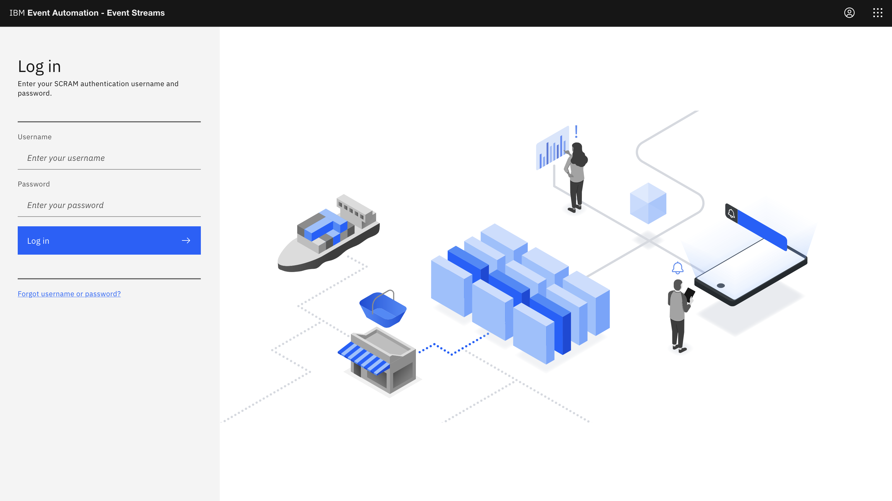
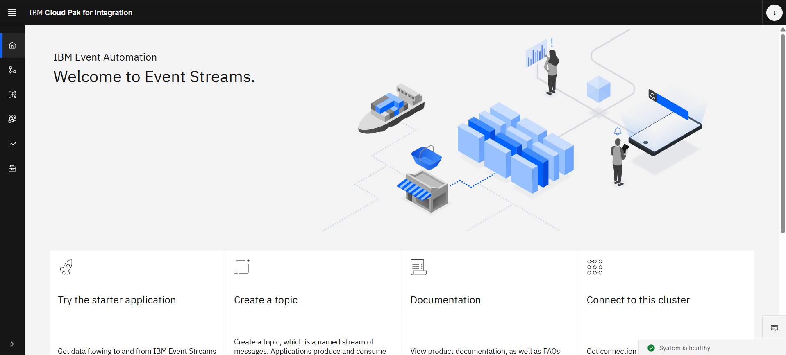
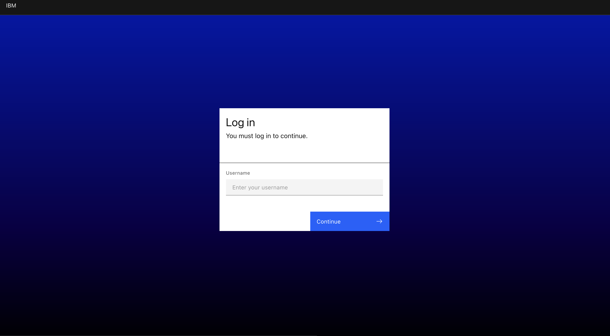
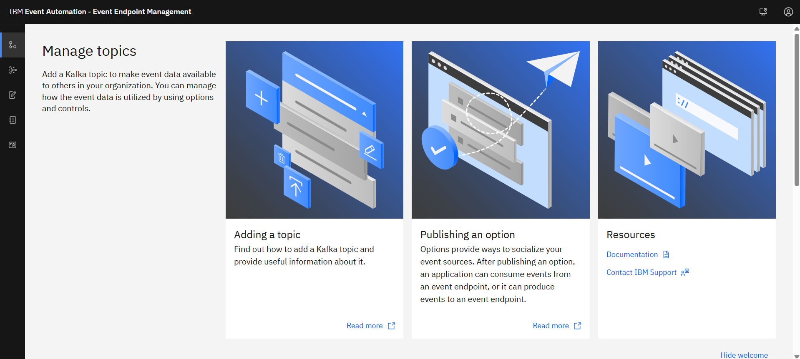
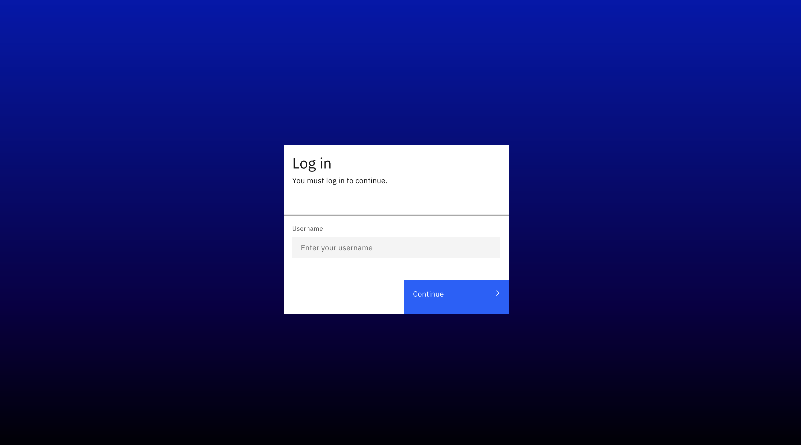
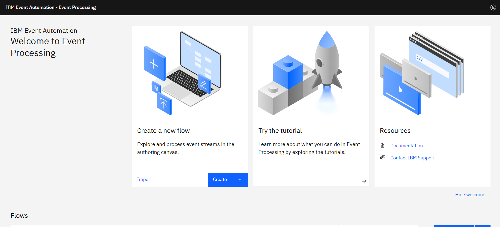

# Introduction

### 1. **Access Event Stream Portal (Lab 1)**

An Event Stream is a continuous, real-time flow of data made up of a series of "events," ordered by the time they occurred. Each event represents a significant change in state, action, or occurrence within a system or business    
   - Click event stream cluster [here](https://my-kafka-cluster-ibm-es-ui-event-automation.apps.687592dfb8103048ba01cdd1.ap1.techzone.ibm.com/login)
   
   - You will see dashboard event stream like this picture.
   
   - Now, you can go to [Lab 1](https://github.com/Client-Engineering-Indonesia/workshop-event-automation/blob/main/lab-1.md)
---

### 2. **Access Event Endpoint Management/EEM Portal (Lab 2)**

Event Endpoint Management (EEM) is a capability that allows organizations to discover, govern, and secure access to their event streams.
   - Click event endpoint management(EEM) [here](https://my-eem-manager-ibm-eem-manager-event-automation.apps.687592dfb8103048ba01cdd1.ap1.techzone.ibm.com/login/login?state=OJSvZMYP)
   
   - Now, you can go to [Lab 2](https://github.com/Client-Engineering-Indonesia/workshop-event-automation/blob/main/lab-2.md)
   

### 2. **Access Event Processing/EP Portal (Lab 3)**

Event Processing is a scalable, low-code event stream processing platform that helps you transform and act on data in real time.
   - Click event processing(EP) [here](https://my-event-processing-ibm-ep-rt-event-automation.apps.687592dfb8103048ba01cdd1.ap1.techzone.ibm.com/login/login?state=AFORt0ue)
   
   - Now, you can go to [Lab 3](https://github.com/Client-Engineering-Indonesia/workshop-event-automation/blob/main/lab-3.md)
   

