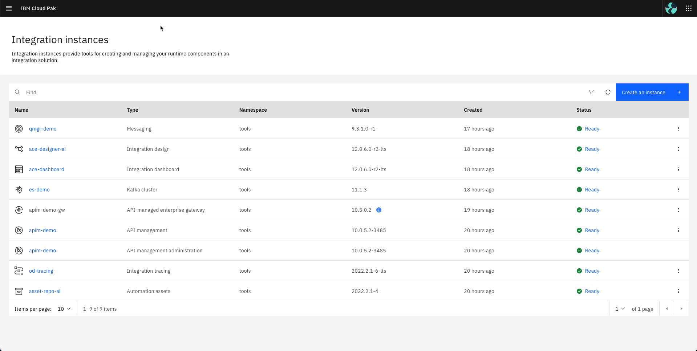

# IBM CP4I installation instructions for older versions

**Note:**
* This guide is kept for reference purposes, you should use the ReadMe to install either the latest LTS or CD versions.

This guide assumes you already have an OCP cluster with the right version and capacity (v4.10.x and at least 80 vCPUs and 320 GB of memory, i.e. 5 worker nodes 16 vCPUs X 64 GB memory each) up and running on IBM Cloud, either in your own account or via [TechZone](https://techzone.ibm.com/environments). And that you are already logged into your OCP cluster.

Based on where you have deployed your OCP cluster you will need to set up an environment vairiabe to use the proper `storage classes` when deploying the instances. The two option available at the moment are ROKS and ODF, so use one of the following commnands to set the environment variable to match your environment:

```
export OCP_TYPE=ROKS
or 
export OCP_TYPE=ODF
```

To select which version you want to deploy set up the correspponding environment variable. The options available are the latest LTS and CD versions, so use one of the following commands:

```
export CP4I_VER=2022.2
or
export CP4I_VER=2023.2
```

If needed you can still use v2022.4, but it is not recommended since it is a CD release and there are no new fixes available. Check the following link for more details [IBM Cloud Pak for Integration Software Support Lifecycle Addendum](https://www.ibm.com/support/pages/ibm-cloud-pak-integration-software-support-lifecycle-addendum). If you want to go this route use the folowing command:

```
export CP4I_VER=2022.4
```

By default tracing will not be enabled for simplicity. For clarify, when you are deploying CP4I v2022.2 tracing means **Operations Dashbaord**, and when using v2022.4 onwards it is **Instana**. In any case, if your demo does require this option you can enable it setting the environment variable `CP4I_TRACING` to any value. You can use the following command as a reference if needed.

```
export CP4I_TRACING=YES
```

Before you start you can check you have the tools used by this repo running the following script:

```
scripts/00a-cp4i-prereq-vaidation.sh
```

We will start installing the overall prerequisites that will help to demonstrate the integration with OCP. To do so, run the following command to install the logging functionality. The script will track the progress and it will send you an email to your *mailtrap* inbox when the operators and logging instance are ready or in case any problem is detected, for that you need to set the environment variables with your *mailtrap* account as shown below.

```
export MAILTRAP_USER=<my-mailtrap-user>
export MAILTRAP_PWD=<my-mailtrap-pwd>
scripts/00b-logging-install.sh
```

To confirm the installation completed successfully after receiving the email you can run the following commands:

```
oc get csv -n openshift-logging
oc get pods -n openshift-logging
```

You should receive a response like this for each command respectively.

```
NAME                            DISPLAY                            VERSION   REPLACES   PHASE
cluster-logging.v5.6.1          Red Hat OpenShift Logging          5.6.1                Succeeded
elasticsearch-operator.v5.6.1   OpenShift Elasticsearch Operator   5.6.1                Succeeded
```

```
NAME                                            READY   STATUS      RESTARTS   AGE
cluster-logging-operator-756b4c48cc-lhkzs       1/1     Running     0          6m41s
collector-njm62                                 2/2     Running     0          5m36s
collector-nxpmd                                 2/2     Running     0          5m36s
collector-xjl96                                 2/2     Running     0          5m36s
collector-xsv6b                                 2/2     Running     0          5m36s
collector-z9k9l                                 2/2     Running     0          5m36s
elasticsearch-cdm-dxgp4gmf-1-577dc997c-sk7kg    2/2     Running     0          5m36s
elasticsearch-cdm-dxgp4gmf-2-5f5d564466-cgk6x   2/2     Running     0          5m35s
elasticsearch-cdm-dxgp4gmf-3-8695d6658c-lxblf   2/2     Running     0          5m33s
elasticsearch-im-app-27947625-m6qd9             0/1     Completed   0          2m58s
elasticsearch-im-audit-27947625-ht4jj           0/1     Completed   0          2m58s
elasticsearch-im-infra-27947625-r9j8c           0/1     Completed   0          2m58s
kibana-746f699cc-72qfk                          2/2     Running     0          5m34s
```

Next we will install the prerequisites for observability (aka Instana) if needed. To do so, run the following script otherwise go to the next step.

```
scripts/01a-tracing-install.sh
```

To confirm the installation completed successfully after receiving the email you can run the following commands:

```
oc get csv -n openshift-distributed-tracing
oc get jaeger -n openshift-distributed-tracing
```

You should receive a response like this for each command respectively.

```
NAME                               DISPLAY                                                 VERSION    REPLACES                           PHASE
elasticsearch-operator.v5.6.1      OpenShift Elasticsearch Operator                        5.6.1                                         Succeeded
jaeger-operator.v1.39.0-3          Red Hat OpenShift distributed tracing platform          1.39.0-3   jaeger-operator.v1.34.1-5          Succeeded
opentelemetry-operator.v0.63.1-4   Red Hat OpenShift distributed tracing data collection   0.63.1-4   opentelemetry-operator.v0.60.0-2   Succeeded
```

```
NAME                         STATUS    VERSION   STRATEGY   STORAGE   AGE
jaeger-all-in-one-inmemory   Running   1.39.0    allinone   memory    18m
```

Next we will install and configure the Instana agent. To do so, you need to set the following environment variables based on the information you got from the Instana instance you will be connected to and then run the script.

```
export ZONE_NAME=<my-zone-name>
export CLUSTER_NAME=<my-cluster-name>
export INSTANA_APP_KEY=<instana-app-key>
export INSTANA_SVC_ENDPOINT=<instana-service-endpoint>
export INSTANA_SVC_PORT=<instana-service-port>
scripts/01b-instana-install.sh
```

To confirm the installation completed successfully after receiving the email you can run the following commands:

```
oc get csv -n instana-agent
oc get pods -n instana-agent
```

You should receive a response like this for each command respectively.

```
NAME                               DISPLAY                                                 VERSION    REPLACES                           PHASE
cert-manager.v1.11.0               cert-manager                                            1.11.0     cert-manager.v1.10.2               Succeeded
elasticsearch-operator.v5.6.2      OpenShift Elasticsearch Operator                        5.6.2      elasticsearch-operator.v5.6.1      Succeeded
instana-agent-operator.v2.0.9      Instana Agent Operator                                  2.0.9      instana-agent-operator.v2.0.8      Succeeded
jaeger-operator.v1.39.0-3          Red Hat OpenShift distributed tracing platform          1.39.0-3   jaeger-operator.v1.34.1-5          Succeeded
opentelemetry-operator.v0.63.1-4   Red Hat OpenShift distributed tracing data collection   0.63.1-4   opentelemetry-operator.v0.60.0-2   Succeeded
```

```
NAME                  READY   STATUS    RESTARTS   AGE
instana-agent-75dkm   1/1     Running   0          5m6s
instana-agent-8gr46   1/1     Running   0          5m6s
instana-agent-xpj95   1/1     Running   0          5m6s
instana-agent-xxncc   1/1     Running   0          5m6s
instana-agent-zvflw   1/1     Running   0          5m6s
```

Now we can proceed with the CP4I installation. We'll follow the GitOps framework in the installation process, so you will need one namespace called `tools` where you will deploy the different capabilities. You can create the namespaces the way you want or you can use the following script which also creates the secret for the `ibm entitlement key`:

```
export ENT_KEY=<my-key>
scripts/02a-cp4i-ns-key-config.sh
```

Then we will continue with the **Infrastructure** layer installing the operators we will use for the demo. To do so, you will enable the IBM Catalog Source in your cluster. Once you login into the cluster run the following command:

```
oc apply -f catalog-sources/${CP4I_VER}/00-cp4i-catalog-sources.yaml
```

Validate the catalog sources have been added successfully using the following command:

```
oc get pods -n openshift-marketplace
```

You should have a response like this:

```
NAME                                               READY   STATUS    RESTARTS   AGE
appconnect-operator-catalogsource-bfwz2            1/1     Running   0          83s
aspera-operators-qvv4w                             1/1     Running   0          82s
certified-operators-7m5p6                          1/1     Running   0          14h
cloud-native-postgresql-catalog-5p9mk              1/1     Running   0          88s
community-operators-4rbc4                          1/1     Running   0          14h
ibm-apiconnect-catalog-8nxq5                       1/1     Running   0          87s
ibm-cloud-databases-redis-operator-catalog-8tdns   1/1     Running   0          82s
ibm-datapower-operator-catalog-g7mz2               1/1     Running   0          89s
ibm-eventautomation-flink-catalog-pzkgc            1/1     Running   0          80s
ibm-eventendpointmanagement-catalog-7dp2l          1/1     Running   0          81s
ibm-eventprocessing-catalog-hjfn8                  1/1     Running   0          79s
ibm-eventstreams-catalog-rdmxd                     1/1     Running   0          86s
ibm-integration-asset-repository-catalog-8vcsh     1/1     Running   0          90s
ibm-integration-platform-navigator-catalog-c55kq   1/1     Running   0          90s
ibmmq-operator-catalogsource-qh87k                 1/1     Running   0          85s
marketplace-operator-7d5f89cc56-tmdfc              1/1     Running   0          14h
opencloud-operators-8dzp8                          1/1     Running   0          91s
redhat-marketplace-5qtvt                           1/1     Running   0          14h
redhat-operators-sp8jf                             1/1     Running   0          14h
```

Once you confirm the catalog sources are ready you can proceed to install the CP4I operators running the following script.

```
scripts/02b-cp4i-apply-subscriptions.sh
```

Once you get the email or if you want to check manually run the following command:

```
oc get csv -n openshift-operators
```

And you should get the following response with all the operators listed:

```
NAME                                          DISPLAY                                                                                        VERSION   REPLACES                                      PHASE
datapower-operator.v1.6.4                     IBM DataPower Gateway                                                                          1.6.4     datapower-operator.v1.6.3                     Succeeded
ibm-apiconnect.v3.0.0                         IBM API Connect                                                                                3.0.0                                                   Succeeded
ibm-appconnect.v5.0.1                         IBM App Connect                                                                                5.0.1     ibm-appconnect.v5.0.0                         Succeeded
ibm-aspera-hsts-operator.v1.5.2               IBM Aspera HSTS                                                                                1.5.2     ibm-aspera-hsts-operator.v1.5.1               Succeeded
ibm-cloud-databases-redis.v1.5.3              IBM Operator for Redis                                                                         1.5.3     ibm-cloud-databases-redis.v1.5.2              Succeeded
ibm-common-service-operator.v3.19.5           IBM Cloud Pak foundational services                                                            3.19.5    ibm-common-service-operator.v3.19.4           Succeeded
ibm-eventstreams.v3.0.5                       IBM Event Streams                                                                              3.0.5     ibm-eventstreams.v3.0.4                       Succeeded
ibm-integration-asset-repository.v1.5.2       IBM Automation Foundation assets (previously IBM Cloud Pak for Integration Asset Repository)   1.5.2                                                   Succeeded
ibm-integration-operations-dashboard.v2.6.3   IBM Cloud Pak for Integration Operations Dashboard                                             2.6.3     ibm-integration-operations-dashboard.v2.6.2   Succeeded
ibm-integration-platform-navigator.v6.0.3     IBM Cloud Pak for Integration                                                                  6.0.3     ibm-integration-platform-navigator.v6.0.2     Succeeded
ibm-mq.v2.0.4                                 IBM MQ                                                                                         2.0.4     ibm-mq.v2.0.3                                 Succeeded
```

Once you have verified all the operators have been installed we will work on the **Services** layer and
you can proceed to create the instance for each capability we will use in the demo, but before you do that, you may want to enable monitoring for the CP4I capabilities in your cluster. If you want to do that use the following command, otherwise go to the next step.

```
oc apply -f resources/01g-monitoring-config.yaml
```

The first service we will create is the Platform UI instance. You can use the following script to do so.  

```
scripts/03a-platform-navigator-inst-deploy.sh
```

Note that this step will also install the required common services, so it can take up to one hour to get the Platform UI ready. 

If you want to check the progress manually you can run the following command:

```
oc get platformnavigator -n tools
```

Once you receive the email or you get the following response from the previous command you can move to the next step:

```
NAME             REPLICAS   VERSION      READY   LASTUPDATE   AGE
cp4i-navigator   3          2022.2.1-3   True    33s          43m
```

The rest of the activities are executed from the *cli* but if you want to access the Platform UI to track the progress you can use the following script to get the URL and credentials.

```
scripts/03b-cp4i-access-info.sh
```

Until CP4I v2022.4 License Service was installed as part of Platform UI, but starting with v2023.2 you need to install it separately. So if you plan to demo License Service you will need to deploy the corresponding instance if going the CD release route. You can use the following script if needed, otherwise skip this section altogether or go to the License Reporter section.

```
scripts/04a-license-service-inst-deploy.sh
```

Confirm License Service has been deployed successfully running the following commnand:

```
oc get pods -n ibm-common-services | grep ibm-licensing-service-instance
```

You will get a response like this:

```
ibm-licensing-service-instance-5f95b74d68-h49s4          1/1     Running     0             5m56s
```

To provide a better experience for License Service you will need to deploy an instance of License Reporter in order to show data via the dashboard. To do so, run the following script once Platform UI is up and running alongside License Service, otherwise go to the next step.

```
scripts/04b-license-reporter-inst-deploy.sh
```

Confirm License Reported has been deployed successfully running the following commnand:

```
oc get pods -n ibm-common-services | grep ibm-license-service-reporter-instance
```

You will get a response like this:

```
ibm-license-service-reporter-instance-85dd967d7-bfr8m   3/3     Running     0             17h
```

Now you can deploy an instance of the Asset Repository using the following script:

```
scripts/05-asset-repo-inst-deploy.sh
```

**Note**: The Asset Repo instance now includes the AI feature.

Once the instance is deployed you will get an email. To confirm Asset Repo has been installed successfully you can use the following command:

```
oc get assetrepository -n tools
```

Once it has been installed successfully you will see the following response for the command and you can proceed to the next step.

```
NAME            PHASE   VERSION      AGE
asset-repo-ai   Ready   2022.2.1-2   21m
```

If you are deploying CP4I v2022.2 and you have decided to enable tracing, then you need to deploy an instance of Operations Dashboard. To do so, run the following script, otherwise skip this step and proceed to the next one.

```
scripts/06-operations-dashboard-inst-deploy.sh
```

Once the instance is deployed you will get an email. To confirm Operations Dashboard has been installed successfully you can use the following command:

```
oc get operationsdashboard -n tools
```

Once it has been installed successfully you will see the following response for the command and you can proceed to the next step.

```
NAME         PHASE   AGE   RESOLVEDVERSION   REPLICAS   CUSTOMIMAGES   READY
od-tracing   Ready   13m   2022.2.1-3-lts    0          false
```

Now you can go ahead and deploy API Connect. If you are working with CP4I v2022.2 use the following section starting with this script, otherwise go to the next section. Note that in this case the `AsyncAPI` support will be installed as part of the deployment including the `Event Endpoint Management` (aka EEM) gateway.

```
scripts/07a-apic-inst-deploy-od.sh
```

The deployment will take around 45 minutes, and once again you will receive an email when things are ready to continue. You can also monitor the progress using the following command:

```
oc get apiconnectcluster -n tools
```

Since we have enabled tracing with Operations Dashboard the deployment won't finish until you register the APIC Gateway. The registration request will be submitted as part of the API Gateway deployment.  You can check the status with the following command:

```
oc get gatewaycluster -n tools
```
 
And you will get a response like this:

```
NAME           READY   STATUS    VERSION    RECONCILED VERSION   AGE
apim-demo-gw   1/2     Pending   10.0.5.1                        8m23s
```
 
Once you get the previous response or you get the email notification, execute the following script to complete the registration with Operations Dashboard.

```
scripts/07b-apic-od-registration.sh
```

Now you can use the following script to monitor the progress and get an email when APIC is ready:

```
scripts/07c-apic-deploy-progress-od.sh
```

You can also check the progress manually using the commands mentioned above. After sometime when you receive the new email, you will see the API Gateway in `Running` state as shown below.

```
NAME           READY   STATUS    VERSION    RECONCILED VERSION   AGE
apim-demo-gw   2/2     Running   10.0.5.1   10.0.5.1-2248        16m
```

And you should also get the following response for the whole API Connect Cluster showing a `Ready` state:

```
NAME        READY   STATUS   VERSION    RECONCILED VERSION   AGE
apim-demo   9/9     Ready    10.0.5.1   10.0.5.1-2248        69m
```

If you are working with CP4I v2022.4 onwards then this section describes how to deploy APIC with Instana. Start executing the following script. 

Note that starting with CP4I v2023.2 the APIC version included is v10.0.06 which does NOT install the `Event Enpoint Management` gateway as part of the same deployment, so if you want to demonstrate this feauture you will need to deploy it separately. The scripts are provided in the next step.

```
scripts/07d-apic-inst-deploy-instana.sh
```

Then run the following script once you confirm the APIC instance is ready.

```
scripts/07e-apic-instana-config.sh
```

Once the APIC instance is up and running regardless of the CP4I version you are using, execute the following commands to complete the inital configuration and the creation of the Provider Organization associated with the `admin` user.

```
scripts/07f-apic-initial-config.sh
scripts/07g-apic-new-porg-cs.sh
```

If you want to demonstrate the Assembly functionality you need to create a separate Provider Organization for your own user and a secret, to do so execute the following scripts with the corresponding variables:

```
export USER_NAME=<your-user-name>
export USER_EMAIL=<your-email-address>
export USER_FNAME=<your-first-name>
export USER_LNAME=<your-last-name>
export USER_PWD=<your-personal-password>
scripts/07h-apic-new-porg-lur.sh
scripts/07i-apic-secret-cp4i.sh
```

Now that APIC is up and running, if you are running CP4I v2023.2 and what to show `Event Endpoint Management` (aka EEM) you can install it using the following scripts with the associated environment variables, otherwise you can skip to the next section. 

```
export EEM_ADMIN_PWD=<eem-admin-pwd>
export ES_USER_PWD=<es-user-pwd>
scripts/19a-eem-manager-inst-deploy.sh
scripts/19b-eem-gateway-inst-deploy.sh
```

Note that the integration with APIC is not done automatically and at the moment you need to do a manual configuration. Instructions will be provided shotly.

You can proceed to install Event Streams using the following script:

```
scripts/08a-event-streams-inst-deploy.sh
```

You will receive an email when the instance is ready, or you can check the progress of the deployment manually using the following command:

```
oc get eventstreams -n tools
```

After few minutes you will receive an email and you can confirm with a message like this:

```
NAME      STATUS
es-demo   Ready
```

Once Event Streams is up and running we will perform the initial configuration to define the `topics` and `user` we will use in the demonstration. Run the following command:

```
oc apply -f resources/02a-es-initial-config.yaml
```

Now we will enable `Kafka Connect` to show the integration between *Event Streams* and *MQ* running the following script:

```
scripts/08c-event-streams-kafka-connect-config.sh
```

Confirm the instance is up and running executuing the following command

```
oc get kafkaconnects -n tools
```

You will get a response like this:

```
NAME                  DESIRED REPLICAS   READY
jgr-connect-cluster   1                  True
```

In this case I have preconfigured the `Kafka Connect` instance with the *MQ Source* plugin that we will configure once the *Queue Manager* is ready and I have uploaded the image to [Quay](https://quay.io/) for simplicity, but if you want to create your own image I have included the Docker file as well as the *MQ Source* plugin in the *Extras* folder.

If you want to provide a REST API for integrating HTTP based client applications with your Event Streams cluster run the following script to enable the Kafka Bridge otherwise go to the next step.

```
scripts/08d-event-streams-kafka-bridge-config.sh
```

Confirm the Kafka Bridge was successfully deploy running the following commnd:

```
oc get kafkabridge -n tools
```

You will get a response like this:

```
NAME                 DESIRED REPLICAS   READY
jgr-es-demo-bridge   1                  True
```

As you may know, we introduced Event Automation recently, so if you want to demo Event Processing you can use the following scripts to deploy it in your environment with the corresponding environment variable. You will also deploy a `Kafka Connector` to populate data in the topics to align with the tutorials available, as well as the  PostgreSQL database.

```
scripts/20a-ea-flink-inst-deploy.sh
export EP_ADMIN_PWD=<ep-admin-pwd>
scripts/20b-ea-ep-inst-deploy.sh
oc apply -f resources/02d-es-datagen.yaml
oc apply -f resources/12a-pgsql-subscription.yaml
oc apply -f resources/12b-pgsql-config.yaml
oc apply -f resources/12c-pgsql-db.yaml
```

Once all the resources involved with Event Automation are up and running you can use the following script to get the corresponding URLs to access the different components: 

```
scripts/20c-ea-access-info.sh
```

Technically speaking we only need App Connect Integration Servers to run the demonstration, but to provide a complete user experience we will also deploy the Dashboard and the Designer Authoring tool alongside with a Switch Server to talk about the `callable flow` functionality as part of the **Services** layer. You can use the following scripts:

```
scripts/09a-ace-dashboard-inst-deploy.sh
scripts/09b-ace-switch-server-inst-deploy.sh
scripts/09c-ace-designer-inst-deploy.sh
```

After few minutes you will receive the corresponding emial, or you can run the following commands manually to confirm the deployments succeded:

```
oc get dashboard -n tools
oc get switchserver -n tools
oc get designerauthoring -n tools
```

You will get responses like these showing a `Ready` status for each instance:

```
NAME            RESOLVEDVERSION   REPLICAS   CUSTOMIMAGES   STATUS   URL                                                                                                                                                                      AGE
ace-dashboard   12.0.6.0-r1-lts   1          false          Ready    https://cpd-tools.itzroks-270007kcnp-k0rbj2-6ccd7f378ae819553d37d5f2ee142bd6-0000.us-east.containers.appdomain.cloud/integration/run/integrations/tools/ace-dashboard/   13m
```

```
NAME                RESOLVEDVERSION   CUSTOMIMAGES   STATUS   AGENTCONFIGURATIONNAME     AGE
ace-switch-server   12.0.6.0-r1-lts   false          Ready    ace-switch-server-agentx   98s
```

```
NAME              RESOLVEDVERSION   URL                                                                                                                                                                           CUSTOMIMAGES   STATUS   AGE
ace-designer-ai   12.0.6.0-r1-lts   https://cpd-tools.itzroks-270007kcnp-k0rbj2-6ccd7f378ae819553d37d5f2ee142bd6-0000.us-east.containers.appdomain.cloud/integration/design/integrations/tools/ace-designer-ai/   false          Ready    6m9s
```

At this point once the auxiliary App Connect capabilities have been deployed we have the **Infrastructure** and **Services** layers ready, so we can proceed to work on the **Application** layer. We will start creating the Queue Manager instance.

In order to enable external communication to the Queue Manager we will create the minimum required objects running the following script. Note it will include a trust store to be used by the MQ Explorer that you will need to install separately. Additionally the script will check if you have the MQ Client installed and if so, it will create another key store you can use with an application that used the MQI if you want to demo external integration with MQ. The artifacts will be stores in the `artifacts` folder.

```
scripts/10a-qmgr-pre-config.sh
```

We will use a ConfigMap to inject the objects needed for the demo environment. Use the following command to create the corresponding object:

```
oc apply -f resources/03c-qmgr-mqsc-config.yaml
```

If you review the ConfigMap you will notice we have disabled security for simplicity, but most importantly we have enabled `mq streaming` to highlight this new feature during the demonstration.

Once the ConfigMap has been created you can deploy the Queue Manager instance with the following script:

```
scripts/10b-qmgr-inst-deploy.sh
```

Note the yaml file shows how to use annotations to let License Service know this is a Queue Manager that is used by ACE and therefore it won't consume VPCs. Additionally the deployment enables tracing, but since we are using the same namespace there is no need to register again with Operations Dashboard. You only need to register once per namespace.

To manually check the progress of the deployment you can use the following command:

```
oc get queuemanager -n tools
```

After a few miutes you should receive an email that you can validate checking you get the following response with phase in `Running` state:

```
NAME        PHASE
qmgr-demo   Running
```

Once the queue manager is up and running you can create a CCDT in case you need to show how to integrate an application running outside the cluster with a queue manager. To do so run the following script, just note it requires to have at least the MQ Client installed in your workstation and you should have updated the pre configuration script to create the corresponding certificates, otherwise you can skip this step, it won't affect the rest of the demo.

```
scripts/10c-qmgr-post-config.sh
```

Now that the queue manager is ready we will complete the configuration of the *MQ Source* and *MQ Sink* connectors as part of `Kafka Connect` running the following commands:

```
oc apply -f resources/02b-es-mq-source.yaml
oc apply -f resources/02c-es-mq-sink.yaml
```

You can check the connector is ready running the following command:

```
oc get kafkaconnector -n tools
```

And you will get a response like this:

```
NAME            CLUSTER               CONNECTOR CLASS                                                         MAX TASKS   READY
mq-sink         jgr-connect-cluster   com.ibm.eventstreams.connect.mqsink.MQSinkConnector                     1           True
mq-source       jgr-connect-cluster   com.ibm.eventstreams.connect.mqsource.MQSourceConnector
```

If you want to include the Native HA functionality alongside with Uniform Cluster as part of your MQ demonstration, you can use the following commands:

```
oc apply -f resources/03d-qmgr-uniform-cluster-config.yaml
oc apply -f instances/${CP4I_VER}/${OCP_TYPE}/13a-qmgr-uniform-cluster-qm1.yaml -n cp4i
oc apply -f instances/${CP4I_VER}/${OCP_TYPE}/13b-qmgr-uniform-cluster-qm2.yaml -n cp4i
```

We can proceed to work with the Integrations that we will use during the demonstration via Integration Servers. But first we need to start deploying the supporting Configurations.

For automation purposes we are going to deploy BAR files directly. They are located in a public repo since at the time of writting of this guide an enterprise repo is not supported by App Connect due to the authentication requirements. You do not to clone this repo, but if you want to take a look, the repo is located [here](https://github.com/gomezrjo/cp4idemo).

Let's start creating the BARAuth Configuration that we will use for each deployment running the following script

```
scripts/11-ace-config-barauth-github.sh
```

Followed by the corresponding MQ Policy for those integrations interaction with the Queue Manager we deployed before using the following script. 

```
scripts/12a-ace-config-policy-mq.sh
```

Then we will simulate a Designer based  integration that connects to SalesForce. However, if you have a Sales Force account and want to demonstrate real integration then set the following environment variable to let the script know you will use Sales Force and then proceed to provide the parameters to configure your Sales Force account.

```
export SF_CONNECTOR=YES
```

You can use the following instructions to configure the SalesForce account.

```
export SF_USER=<my-sf-user>
export SF_PWD=<my-sf-pwd>
export SF_CLIENT_ID=<my-sf-client-id>
export SF_CLIENT_SECRET=<my-sf-client-secret>
export SF_LOGIN_URL=<my-sf-login-url>
scripts/12b-ace-config-accounts-sf.sh
```

Now that we have the dependencies we can deploy the Integrations directly related with the API. Run the following scripts.

```
scripts/12c-ace-is-apis-inst-deploy.sh
scripts/12d-ace-is-sf-inst-deploy.sh
```

After a few minutes you can use one of the following commands to confirm the deployments completed successfully.

If deploying CP4I v2022.2:

```
oc get integrationservers -n tools
```

Otherwise use:

```
oc get integrationruntimes -n tools
```

And you should get a response like this showing the Integration Servers or Integration Runtimes are in `Ready` state:

```
NAME                       RESOLVEDVERSION   REPLICAS   AVAILABLEREPLICAS   CUSTOMIMAGES   STATUS   AGE
ace-designer-ai-designer   12.0.6.0-r1-lts   1          1                   false          Ready    48m
jgr-designer-sfleads       12.0.6.0-r1-lts   1          1                   false          Ready    10m
jgr-mqapi-dflt             12.0.6.0-r1-lts   1          1                   false          Ready    10m
jgr-mqapi-prem             12.0.6.0-r1-lts   1          1                   false          Ready    10m
```

```
NAME                   RESOLVEDVERSION   STATUS   REPLICAS   AVAILABLEREPLICAS   URL                                                                                                                                          AGE     CUSTOMIMAGES
jgr-designer-sfleads   12.0.7.0-r2       Ready    1          1                   http://jgr-designer-sfleads-http-tools.itzroks-270007kcnp-vg64r1-4b4a324f027aea19c5cbc0c3275c4656-0000.us-south.containers.appdomain.cloud   4h49m   false
jgr-mqapi-dflt         12.0.7.0-r2       Ready    1          1                   http://jgr-mqapi-dflt-http-tools.itzroks-270007kcnp-vg64r1-4b4a324f027aea19c5cbc0c3275c4656-0000.us-south.containers.appdomain.cloud         4h49m   false
jgr-mqapi-prem         12.0.7.0-r2       Ready    1          1                   http://jgr-mqapi-prem-http-tools.itzroks-270007kcnp-vg64r1-4b4a324f027aea19c5cbc0c3275c4656-0000.us-south.containers.appdomain.cloud         4h49m   false
```

Now that the Integration end points are ready we can proceed to publish the Product and API associated with the Integration in APIC to demonstrate the API Management capabilities. Run the following commands:

```
scripts/14a-apic-create-apis-draft.sh
scripts/14b-apic-config-catalogs-publish-apis.sh
export APPDEV_PWD=<my-user-pwd>
scripts/14c-apic-new-consumer-org.sh
scripts/14d-apic-create-apps-subscription.sh
```

Note the second script will also enable the `Developer Portal` in the `Sandbox` catalog and it will create a second catalog called `Demo` with its corresponding `Developer Portal`. You will need to reset the password for the `admin` user in both catalogs once you receive the corresponding emails in your `mailtrap` inbox.

Additionally, the third script will create a `Consumer Organization` called *AppDev* and the associated user that you can use from the `Developer Portal`. The user is *andre* with the password you defined in the environment variable *APPDEV_PWD*. The fourth script will create  two `Apps` called *CP4I Dflt App* and *CP4I Prem App* tht will be used with the Rest API and another `App` called *CP4I Demo App* that we will use with the `AsyncAPI` and this will have the corresponding subscription.  

Since the demo scenario uses Event Streams we will need to create few additional *Configurations*, including a Policy, the Credentials (SetDBParms)  and a TrustStore since we are using a secure connection based on SCRAM to connect to Event Streams. To do so you can use the following scripts 

```
scripts/15a-ace-config-policy-es-scram.sh
scripts/15b-ace-config-setdbparms-es-scram.sh
scripts/15c-ace-config-truststore-es.sh
```

Now we'll deploy the rest of the micro-integrations and the required *Configurations* to complete the demo scenario, including a `User Defined Policy` and those needed to integrate with the *mailtrap* server. To do so use the following scripts and commands

```
scripts/15d-ace-is-extra-inst-deploy.sh
scripts/16-ace-config-policy-udp.sh
scripts/17a-ace-config-policy-email.sh
scripts/17b-ace-config-setdbparms-email.sh
```

The last micro-integration involves a kafka consumer node to demonstrate event notification associated with a basic *Event Driven Architecture* scenario. In this case you have two options, connect to *Event Streams* directly or use the *Event Gateway* instead.

**Note: CP4I v2023.2 changed the way EEM integrated with APIC, that requires some extra configuration that at the moment is not included in the scripts, so for now you can only use the direct integration with *Event Streams*, so do not try the bake approach described below until further notice if you are using this version of CP4I**

If your demonstration wants to highlight *Event Endpoint Management* it is better if you use the *Event Gateway* even though it requires some extra work which is described below, otherwise just deploy the last micro-integration that is already configured to use Event Streams running the following script and skip the extra configuration and go straight to confirming the *Integrations* have been deployed successfully.

```
scripts/18a-ace-is-kafka-inst-deploy.sh
```

During the APIC configuration we created a subscription to the `AsyncAPI` using the *Default Plan* for the `CP4I Demo App`. In order to use the *client id* generated at that time, we need to create an ACE custom image using the *bake* approach to inject the *client id* into the integration flow we got from the previous step. To do so run the following script

```
scripts/18b-ace-bake-eem-image.sh
```

Check the process completed ssuccessfully running the following command:

```
oc get imagestreams -n tools
```

You should get a response like this:

```
NAME                              IMAGE REPOSITORY                                                                         TAGS    UPDATED
ace-12.0.6.0-r2-lts-kafka2email   image-registry.openshift-image-registry.svc:5000/tools/ace-12.0.6.0-r2-lts-kafka2email   1.0.0   4 minutes ago
```

Now we can procede to deploy the required configurations and the corresponding integration server instance. To do so run the following commands

```
scripts/18c-ace-config-policy-eem.sh
scripts/18d-ace-config-setdbparms-eem.sh
scripts/18e-ace-config-truststore-eem.sh
scripts/18f-ace-is-eem-inst-deploy.sh
```

To confirm the Integrations have been deployed successfully you can use one of the following commands again.

If deploying CP4I v2022.2:
```
oc get integrationserver -n tools
```

Otherwise:
```
oc get integrationruntimes -n tools
```

After a few minutes you will see all the Integrations in `Ready` status as shown below:

```
NAME                       RESOLVEDVERSION   REPLICAS   AVAILABLEREPLICAS   CUSTOMIMAGES   STATUS   AGE
ace-designer-ai-designer   12.0.6.0-r1-lts   1          1                   false          Ready    60m
jgr-designer-sfleads       12.0.6.0-r1-lts   1          1                   false          Ready    21m
jgr-kafka-email            12.0.6.0-r1-lts   1          1                   false          Ready    3m7s
jgr-mock-backend           12.0.6.0-r1-lts   1          1                   false          Ready    3m48s
jgr-mqapi-dflt             12.0.6.0-r1-lts   1          1                   false          Ready    21m
jgr-mqapi-prem             12.0.6.0-r1-lts   1          1                   false          Ready    21m
jgr-mqfwd-event            12.0.6.0-r1-lts   1          1                   false          Ready    3m59s
```

```
NAME                   RESOLVEDVERSION   STATUS   REPLICAS   AVAILABLEREPLICAS   URL                                                                                                                                          AGE     CUSTOMIMAGES
jgr-designer-sfleads   12.0.7.0-r2       Ready    1          1                   http://jgr-designer-sfleads-http-tools.itzroks-270007kcnp-vg64r1-4b4a324f027aea19c5cbc0c3275c4656-0000.us-south.containers.appdomain.cloud   4h59m   false
jgr-kafka-email        12.0.7.0-r2       Ready    1          1                   http://jgr-kafka-email-http-tools.itzroks-270007kcnp-vg64r1-4b4a324f027aea19c5cbc0c3275c4656-0000.us-south.containers.appdomain.cloud        105s    false
jgr-mock-backend       12.0.7.0-r2       Ready    1          1                   http://jgr-mock-backend-http-tools.itzroks-270007kcnp-vg64r1-4b4a324f027aea19c5cbc0c3275c4656-0000.us-south.containers.appdomain.cloud       2m27s   false
jgr-mqapi-dflt         12.0.7.0-r2       Ready    1          1                   http://jgr-mqapi-dflt-http-tools.itzroks-270007kcnp-vg64r1-4b4a324f027aea19c5cbc0c3275c4656-0000.us-south.containers.appdomain.cloud         4h59m   false
jgr-mqapi-prem         12.0.7.0-r2       Ready    1          1                   http://jgr-mqapi-prem-http-tools.itzroks-270007kcnp-vg64r1-4b4a324f027aea19c5cbc0c3275c4656-0000.us-south.containers.appdomain.cloud         4h59m   false
jgr-mqfwd-event        12.0.7.0-r2       Ready    1          1                   http://jgr-mqfwd-event-http-tools.itzroks-270007kcnp-vg64r1-4b4a324f027aea19c5cbc0c3275c4656-0000.us-south.containers.appdomain.cloud        2m37s   false
```

To complete the demonstration from the API Management angle you will need to create the corresponding subscriptions from the Developer Portal to the plans associated with the products we published in previous steps. But for an initial test you can use API Manager and make the API online we published in Drafts and execute it from the Explorer perspective.

In addition to the Integration Servers needed for the demonstration I have included 4 more that can be used to show some specific capabilities, that even though are not part of the demo can be useful for small conversations and I'm also leveraging the new Assembly functionality to deploy all of them together. To enable those extra micro-integrations execute the following commands:

```
oc apply -f resources/08-ace-mount-volume-demo.yaml
oc apply -f assemblies/${CP4I_VER}/${OCP_TYPE}/01-cp4i-ia-extra-ace-irs.yaml
```

The two **ace-ivt** instances can be used to explain the following two concepts:

1. `Bake` vs `Fry` deployment strategy in ACE. So far we have used the *Fry* approach, but the last instance uses *Bake* to build the custom image using a specific ACEcc version. You can check the `DockerFile` in the *extras* folder to understand how I built the image. Note in this case I'm using [Quay](https://quay.io/) as the external image repository.

2. The `Horizontal Pod Autoscaling` functionality in ACE, since it deploys two replicas as part of the initial deployment, and you can complement it with the following command that will enable HPA. If this topic is not relevant for your demo you can skip it.

If you are deploying CP4I v2022.2 use the first command otherwise use the second one instead. 

```
oc apply -f resources/09a-ace-hpa-demo.yaml
```

```
oc apply -f resources/09b-ace-hpa-demo.yaml
```

At this point your CP4I demo environment is ready to be used. Your can start checking the Platform UI to confirm you have all the *Integration Instances* up and running as shown in the following image:



Good luck with your demo!

## Developer Experience

So far we have focused on the "runtime" aspect of the deployment, but to provide a full demo experience, in some cases you will need to walk a customer through the assets that make up the demo scenario.

Each one of the micro-integrations was developed using the App Connect Toolkit or the Designer Autoring Tool.

To show the App Connect Toolot assets you can take advantage of the `git` integration available in v12. You will simple fork this [repo](https://github.ibm.com/joel-gomez/cp4i-ace-artifacts) and then clone the repo following the instructions in Toolkit.

At the end you will have the following assets:

* 4 Applications
* 1 Library
* 3 REST API Projects
* 4 Policies

This is the detailed list:

* **JGRMQAPIPREM** is the Integration that exposes an MQ Queue as a REST API. 

* **JGRFWDMQEVNTMULTI** is the Integration that gets the MQ message produced by the previous flow and forwards it to another queue doing message transformation and protocol conversion to kafka.

* **JGREVENT2MAIL** is the Integration that is subscribed to a Kafka Topic and using that information sends an email with an attachment. The integration uses an UDP to get the information to be used by the Email Output node.

* **JGRCP4IBACKEND** is the Integration that simulates the Back End system that processes the request message.

The followin Integreations are not part of ther main scenario, but they can be used for specific topic points:

* **JGRESAPISCRAM** this integration shows how to interact with Event Streams using the Kafka Producer node exposing a REST API.

* **JGRACEIVT** this integration is a self contained REST API and can be used to deploy independent Integration Servers.

* **JGRMQIVT** is a simple flow to demonstrate the basic ACE functionality with MQ that most "traditional" ACE users want to see.

In the case of Designer assets we will leverage the integration between the Designer Authoring Tool and Asset Repository.

To do so,  you will connect Asset Repository to the following remote git repo: https://github.com/gomezrjo/cp4idemo and then from Designer import the asset.

The particular flow used in the demo scenario is called SFLead.