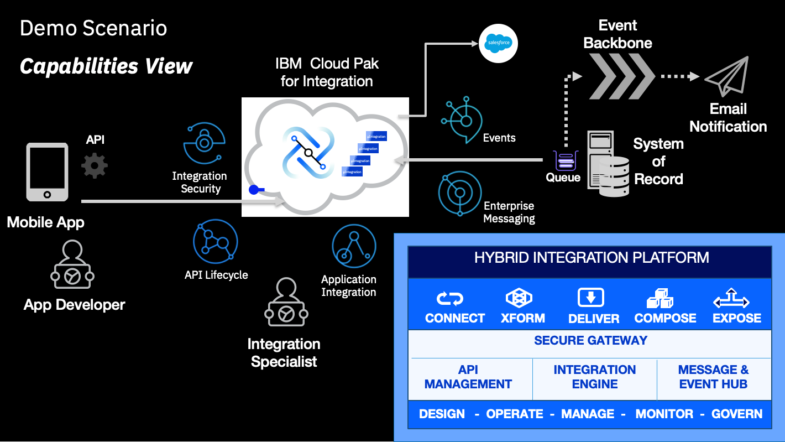

# IBM Cloud Pak for Integration end to end demonstration

This document describes multiple use cases that highlight the multi-style integration patterns needed by an Integration Specialist to implement a digital transformation initiative that showcase the value Cloud Pak for Integration can provide.

In this case a customer has a system of record that has used for many years which was designed to work with MQ to process requirements, and now they want to extend the application to expose an API in a secure way as part of their mobile app.

But the requirement doesn't end there, they are also implementing a new CRM system as a Service and they want to keep both systems in sync without having to modify the original system of record.

Additionally as part of their digital transformation initiative they want to stay closer to their clients and they want to send email notifications when the client is taking certain actions in their mobile app. To support this strategy, the enterprise architecture team wants to implement an event backbone, as part of their event driven architecture.

The following diagram provides a high level view of the scenario:



In order to implement this demo you will need to deploy an instance of each one of the following components in your OCP Cluster:

* API Connect Cluster
* Event Streams Cluster
* Queue Manager
* App Connect Enterprise Integration Servers

The following diagram provides a high level implementation view of the scenario with the core capabilities:


To demonstrate the added value capabilities provided by CP4I you will deploy an instance of the following components in your OCP Cluster:

* Platform UI (formerly known as Platform Navigator)
* Automation Foundation Assets (formerly known as Asset Repository)
* Assemblies

To use this guide you will need to clone this repo to your workstation alongside with the `cp4i-ace-artifacts` repo located [here](https://github.ibm.com/joel-gomez/cp4i-ace-artifacts) that includes the App Connect Integrations.

Additionally you will need to have installed the following tools in your workstation:

* [oc cli](https://docs.openshift.com/container-platform/4.8/cli_reference/openshift_cli/getting-started-cli.html)
* zip
* keytool
* openssl
* [jq](https://stedolan.github.io/jq/)
* [yq](https://github.com/mikefarah/yq)
* [apic cli](https://www.ibm.com/docs/en/api-connect/10.0.x?topic=configuration-installing-toolkit)

Note some of the tools will be available after you deploy an instance of the capability you are working on.

And as part of the App Connect demonstration you will also need to have a SafesForce Developer Account. And in case you want to use the integration that uses the Event End Point Management Gateway you will also need the following tools in your workstation:

* [ACE for Developers](https://www.ibm.com/docs/en/app-connect/12.0?topic=enterprise-download-ace-developer-edition-get-started)
* [podman](https://podman.io/getting-started/installation)

The demo also enables the configuration to access the Queue Manager from outside the cluster using MQ Explorer, and optionally from an application using the MQI API. If you want to use this part of the demo you will need to have at least the MQ Client installed in your workstation.

Lastly, this guide assumes you already have an OCP cluster with the right version and capacity up and running in [TechZone](https://techzone.ibm.com/home), and that you are already logged into your OCP cluster. For best results I recomments you use OCP v4.16.x with 5 worker nodes 32 vCPUs X 128 GB memory each. If you need further instructions to provision a cluster in TechZone follow this [link](TechZoneGuide.md).

Based on the type of OCP cluster you have provisioned, you will need to set up an environment variable to use the proper `storage classes` when deploying the instances. The two option available at the moment are ODF and TZEXT. Note that TechZone is moving to use OCP-V and the new request form doesn't allow you to select the storage type, it will automatically use an external ODF configuration. And if you are still using the previous options, you need to make sure to use ODF otherwise you may end up with a cluster using NFS that is NOT supported and you will need to recreate your cluster.

Do not forget to clone repo `cp4i-ace-artifacts` to your workstation alongside with this repo. The repo is located [here](https://github.ibm.com/joel-gomez/cp4i-ace-artifacts), it includes the App Connect Integrations. And check the list of pre-requisites before using this guide using the following command:
      ```
      scripts/00a-cp4i-prereq-vaidation.sh
      ```

Once you confirm you have the required tools in your workstation you are ready to use the following guide. 

Note the scripts used in this guide have been developed and tested on mac os. 

<details>
<summary>
A) Set environment variables:
</summary>

1. Set the CP4I version you want to install. The options available are either the latest LTS or CD releases, so use the following commands:
    ```
    export CP4I_VER=16.1.0
    or
    export CP4I_VER=16.1.1
    ```
2. Set the OCP type based on the storage classes in your cluster:
   1. Run command to identify the type you have to set up:
      ```
      oc get sc
      ```
      Your will get a response like this:
      ```
      NAME                                    PROVISIONER                             RECLAIMPOLICY   VOLUMEBINDINGMODE      ALLOWVOLUMEEXPANSION   AGE
      localblock                              kubernetes.io/no-provisioner            Delete          WaitForFirstConsumer   false                  50d
      ocs-storagecluster-ceph-rbd (default)   openshift-storage.rbd.csi.ceph.com      Delete          Immediate              true                   50d
      ocs-storagecluster-ceph-rgw             openshift-storage.ceph.rook.io/bucket   Delete          Immediate              false                  50d
      ocs-storagecluster-cephfs               openshift-storage.cephfs.csi.ceph.com   Delete          Immediate              true                   50d
      openshift-storage.noobaa.io             openshift-storage.noobaa.io/obc         Delete          Immediate              false                  50d
      ```
      Or this one:
      ```
      NAME                                             PROVISIONER                             RECLAIMPOLICY   VOLUMEBINDINGMODE   ALLOWVOLUMEEXPANSION   AGE
      ocs-external-storagecluster-ceph-rbd (default)   openshift-storage.rbd.csi.ceph.com      Delete          Immediate           true                   88d
      ocs-external-storagecluster-cephfs               openshift-storage.cephfs.csi.ceph.com   Delete          Immediate           true                   88d
      openshift-storage.noobaa.io                      openshift-storage.noobaa.io/obc         Delete          Immediate           false                  88d
      ```
   2. If you get the first response, then use the following command:
      ```
      export OCP_TYPE=ODF
      ```
      Otherwise use this command:
      ```
      export OCP_TYPE=TZEXT
      ```
</details>
&nbsp; 

<details>
<summary>
B) Prepare your cluster:
</summary>

1. Set a default storage class for your cluster. If you have provisioned your OCP cluster in Tech Zone you can use the following script to set the proper default storage class:
   ```
   scripts/99-odf-tkz-set-scs.sh
   ```
2. Configure image registry for your cluster. If you have provisioned your OCP cluster in Tech Zone using OCP-V you can use the following script to enable the image registry:
   ```
   scripts/99-setup-image-registry.sh
   ```
</details>
&nbsp; 

<details>
<summary>
C) Install Logging (optional):
</summary>  

1. Install ElasticSearch Operator:
   ```
   oc apply -f resources/00a-elasticsearch-namespace.yaml
   oc apply -f resources/00b-elasticsearch-operatorgroup.yaml
   oc apply -f resources/00c-elasticsearch-subscription.yaml
   ```
   Confirm the subscription has been completed successfully before moving to the next step running the following command:
   ```
   SUB_NAME=$(oc get deployment elasticsearch-operator -n openshift-operators-redhat --ignore-not-found -o jsonpath='{.metadata.labels.olm\.owner}');if [ ! -z "$SUB_NAME" ]; then oc get csv/$SUB_NAME -n openshift-operators-redhat --ignore-not-found -o jsonpath='{.status.phase}';fi;echo
   ```
   You should get a response like this:
   ```
   Succeeded
   ```
2. Install Logging Operator:
   ```
   oc apply -f resources/00d-logging-namespace.yaml
   oc apply -f resources/00e-logging-operatorgroup.yaml
   oc apply -f resources/00f-logging-subscription.yaml
   ```
   Confirm the subscription has been completed successfully before moving to the next step running the following command:
   ```
   SUB_NAME=$(oc get deployment cluster-logging-operator -n openshift-logging --ignore-not-found -o jsonpath='{.metadata.labels.olm\.owner}');if [ ! -z "$SUB_NAME" ]; then oc get csv/$SUB_NAME -n openshift-logging --ignore-not-found -o jsonpath='{.status.phase}';fi;echo
   ```
   You should get a response like this:
   ```
   Succeeded
   ```
3. Deploy Logging instance:
   ```
   scripts/00b-logging-install-alt.sh
   ```
   Confirm the instance has been deployed successfully before moving to the next step running the following command:
   ```
   oc get pods -n openshift-logging
   ```
   You should receive a response like this:
   ```
   NAME                                            READY   STATUS      RESTARTS   AGE
   cluster-logging-operator-756b4c48cc-lhkzs       1/1     Running     0          6m41s
   collector-njm62                                 2/2     Running     0          5m36s
   collector-nxpmd                                 2/2     Running     0          5m36s
   collector-xjl96                                 2/2     Running     0          5m36s
   collector-xsv6b                                 2/2     Running     0          5m36s
   collector-z9k9l                                 2/2     Running     0          5m36s
   elasticsearch-cdm-dxgp4gmf-1-577dc997c-sk7kg    2/2     Running     0          5m36s
   elasticsearch-cdm-dxgp4gmf-2-5f5d564466-cgk6x   2/2     Running     0          5m35s
   elasticsearch-cdm-dxgp4gmf-3-8695d6658c-lxblf   2/2     Running     0          5m33s
   elasticsearch-im-app-27947625-m6qd9             0/1     Completed   0          2m58s
   elasticsearch-im-audit-27947625-ht4jj           0/1     Completed   0          2m58s
   elasticsearch-im-infra-27947625-r9j8c           0/1     Completed   0          2m58s
   kibana-746f699cc-72qfk                          2/2     Running     0          5m34s
   ```
4. Post-deployment configuration (optional):
   1. Get Kibana URL:
      ```
      echo "https://"$(oc get route kibana -n openshift-logging -o jsonpath='{.spec.host}')
      ```
   2. Copy the URL to your favorite browser and hit "Enter". If you get the login page enter your credentials to get the following page. Accept the default values and click "Allow selected permissions":
   
   3. In the next page enter "app-*" in the `index-pattern` field and then click "Next step" as shown below:
   
   4. In the next page set the `time filter` field to "@timestamp" and then click "Create Index Pattern" as shown below:
   
   4. Now you can create your own Dashboards or search for logs in the Discovery page as shown below:
   
      Note creating a Dashboard is outside of the scope of this repo.
</details>
&nbsp; 

<details>
<summary>
D) Install ArgoCD (optional):
</summary>  

1. Create and configure the namespace:
   ```
   oc create ns openshift-gitops-operator
   oc label namespace openshift-gitops-operator openshift.io/cluster-monitoring=true
   ```
2. Create operator group:
   ```
   oc apply -f resources/00-gitops-operatorgroup.yaml
   ```
3. Create subscription:
   ```
   oc apply -f resources/00-gitops-subscription.yaml
   ```
   Confirm the operator has been deployed successfully before moving to the next step running the following commands:
   ```
   oc get pods -n openshift-gitops-operator
   oc get pods -n openshift-gitops
   ```
   You should receive a response like this for each command respectively.
   ```
   NAME                                                            READY   STATUS    RESTARTS   AGE
   openshift-gitops-operator-controller-manager-7859c4ddd4-j2g8z   2/2     Running   0          98s
   ```
   ```
   NAME                                                          READY   STATUS    RESTARTS   AGE
   cluster-6b66cd5687-h5fhm                                      1/1     Running   0          2m50s
   kam-868f97bd49-2mchk                                          1/1     Running   0          2m50s
   openshift-gitops-application-controller-0                     1/1     Running   0          2m46s
   openshift-gitops-applicationset-controller-7d9dcdf769-s7ssn   1/1     Running   0          2m46s
   openshift-gitops-dex-server-5c66897994-f4wrq                  1/1     Running   0          2m46s
   openshift-gitops-redis-5684c6fc5b-456nt                       1/1     Running   0          2m46s
   openshift-gitops-repo-server-dcf86f4c7-d6x28                  1/1     Running   0          2m46s
   openshift-gitops-server-55dbf6b78b-m4mhw                      1/1     Running   0          2m46s
   ```
4. Enable kustomize:
   ```
   oc patch argocd -n openshift-gitops openshift-gitops --patch '{"spec":{"kustomizeBuildOptions":"--enable-alpha-plugins=true --enable-exec"}}' --type=merge
   ```
5. Once ArgoCD is up and running get the access info:
   ```
   scripts/00c-argocd-access-info.sh
   ```

</details>
&nbsp; 

<details>
<summary>
E) Install Instana (optional):
</summary>

1. Install Instana Agent Operator:
   ```
   oc apply -f resources/01f-instana-agent-subscription.yaml
   ```
   Confirm the subscription has been completed successfully before moving to the next step running the following command:
   ```
   SUB_NAME=$(oc get deployment  controller-manager -n openshift-operators --ignore-not-found -o jsonpath='{.metadata.labels.olm\.owner}');if [ ! -z "$SUB_NAME" ]; then oc get csv/$SUB_NAME -n openshift-operators --ignore-not-found -o jsonpath='{.status.phase}';fi;echo
   ```
   You should get a response like this:
   ```
   Succeeded
   ```
2. Set environment variables:
   ```
   export ZONE_NAME=<my-zone-name>
   export CLUSTER_NAME=<my-cluster-name>
   export INSTANA_APP_KEY=<instana-app-key>
   export INSTANA_SVC_ENDPOINT=<instana-service-endpoint>
   export INSTANA_SVC_PORT=<instana-service-port>
   ```
3. Deploy Instana Agent running script:
   ```
   scripts/01b-instana-install.sh
   ```
   Confirm the instance has been deployed successfully before moving to the next step running the following command:
   ```
   oc get pods -n instana-agent
   ```
   You should receive a response like this.
   ```
   NAME                  READY   STATUS    RESTARTS   AGE
   instana-agent-75dkm   1/1     Running   0          5m6s 
   instana-agent-8gr46   1/1     Running   0          5m6s
   instana-agent-xpj95   1/1     Running   0          5m6s
   instana-agent-xxncc   1/1     Running   0          5m6s
   instana-agent-zvflw   1/1     Running   0          5m6s
   ```
4. Set environment variable:
   ```
   export CP4I_TRACING=YES
   ```

</details>
&nbsp; 

<details>
<summary>
F) Install Common Services and its pre-requisites:
</summary>   

1. Install Cert Manager Operator:
   ```
   oc apply -f resources/00-cert-manager-namespace.yaml
   oc apply -f resources/00-cert-manager-operatorgroup.yaml
   oc apply -f resources/00-cert-manager-subscription.yaml
   ```
   Confirm the subscription has been completed successfully before moving to the next step running the following command:
   ```
   SUB_NAME=$(oc get deployment cert-manager-operator-controller-manager -n cert-manager-operator --ignore-not-found -o jsonpath='{.metadata.labels.olm\.owner}');if [ ! -z "$SUB_NAME" ]; then oc get csv/$SUB_NAME -n cert-manager-operator --ignore-not-found -o jsonpath='{.status.phase}';fi;echo
   ```
   You should get a response like this:
   ```
   Succeeded
   ```
2. Install Common Services Catalog Source:
   ```
   oc apply -f catalog-sources/${CP4I_VER}/02-common-services-catalog-source.yaml
   ```
   Confirm the catalog source has been deployed successfully before moving to the next step running the following command:
   ```
   oc get catalogsources opencloud-operators -n openshift-marketplace -o jsonpath='{.status.connectionState.lastObservedState}';echo
   ```
   You should get a response like this:
   ```
   READY
   ```
3. Create the Common Services namespace:
   ```
   oc create namespace ibm-common-services
   ```
4. Install Common Services Operator:
   ```
   oc apply -f subscriptions/${CP4I_VER}/00-common-service-subscription.yaml
   ```
   Confirm the operator has been deployed successfully before moving to the next step running the following command:
   ```
   SUB_NAME=$(oc get deployment/ibm-common-service-operator -n openshift-operators --ignore-not-found -o jsonpath='{.metadata.labels.olm\.owner}');if [ ! -z "$SUB_NAME" ]; then oc get csv/$SUB_NAME --ignore-not-found -o jsonpath='{.status.phase}';fi;echo
   ```
   You should get a response like this:
   ```
   Succeeded
   ```
</details>
&nbsp; 

<details>
<summary>
G) Create namespaces with the corresponding entitlement key:
</summary>

1. If do not have a key available already, you can get the key from the [Container software library](https://myibm.ibm.com/products-services/containerlibrary).
2. Set your entitlement key:
   ```
   export ENT_KEY=<my-key>
   ```
3. Create namespaces:
   ```
   scripts/02a-cp4i-ns-key-config.sh
   ```
</details>
&nbsp; 

<details>
<summary>
H) Deploy Platform UI:
</summary>

1. Install Platform UI Catalog Source:
   ```
   oc apply -f catalog-sources/${CP4I_VER}/03-platform-navigator-catalog-source.yaml
   ```
   Confirm the catalog source has been deployed successfully before moving to the next step running the following command: 
   ```
   oc get catalogsources ibm-integration-platform-navigator-catalog -n openshift-marketplace -o jsonpath='{.status.connectionState.lastObservedState}';echo
   ```
   You should get a response like this:
   ```
   READY
   ```
2. Install Platform UI Operator:
   ```
   oc apply -f subscriptions/${CP4I_VER}/01-platform-navigator-subscription.yaml
   ```
   Confirm the operator has been deployed successfully before moving to the next step running the following commands:
   ```
   SUB_NAME=$(oc get deployment ibm-integration-platform-navigator-operator -n openshift-operators --ignore-not-found -o jsonpath='{.metadata.labels.olm\.owner}');if [ ! -z "$SUB_NAME" ]; then oc get csv/$SUB_NAME --ignore-not-found -o jsonpath='{.status.phase}';fi;echo
   ```
   You should get a response like this:
   ```
   Succeeded
   ```
3. Deploy a Platform UI instance:
   ```
   scripts/03a-platform-navigator-inst-deploy.sh
   ```
   Confirm the instance has been deployed successfully before moving to the next step running the following command:
   ```
   oc get platformnavigator cp4i-navigator -n tools -o jsonpath='{.status.conditions[0].type}';echo
   ```
   You should get a response like this:
   ```
   Ready
   ```
4. Once the Platform UI instance is up and running get the access info:
   ```
   scripts/03b-cp4i-access-info.sh
   ```
   Note the password is temporary and you will be required to change it the first time you log into Platform UI.
</details>
&nbsp; 

<details>
<summary>
I) Deploy Asset Repo (optional): 
</summary>

1. Install Asset Repo Catalog Source:
   ```
   oc apply -f catalog-sources/${CP4I_VER}/04-asset-repo-catalog-source.yaml
   ```
   Confirm the catalog source has been deployed successfully before moving to the next step running the following command: 
   ```
   oc get catalogsources ibm-integration-asset-repository-catalog -n openshift-marketplace -o jsonpath='{.status.connectionState.lastObservedState}';echo
   ```
   You should get a response like this:
   ```
   READY
   ```
2. Install Asset Repo Operator:
   ```
   oc apply -f subscriptions/${CP4I_VER}/02-asset-repo-subscription.yaml
   ```
   Confirm the operator has been deployed successfully before moving to the next step running the following command:
   ```
   SUB_NAME=$(oc get deployment ibm-integration-asset-repository-operator -n openshift-operators --ignore-not-found -o jsonpath='{.metadata.labels.olm\.owner}');if [ ! -z "$SUB_NAME" ]; then oc get csv/$SUB_NAME --ignore-not-found -o jsonpath='{.status.phase}';fi;echo
   ```
   You should get a response like this:
   ```
   Succeeded
   ```
3. Deploy an Asset Repo instance:
   ```
   scripts/05-asset-repo-inst-deploy.sh
   ```
   Confirm the instance has been deployed successfully before moving to the next step running the following command:
   ```
   oc get assetrepository asset-repo-ai -n tools -o jsonpath='{.status.phase}';echo
   ```
   You should get a response like this:
   ```
   Ready
   ```
4. Post-deployment configuration (optional):
   1. Navigate to the Asset Repo instance from Platform UI clicking on the instance name as shown below:
      
   2. From the main page select the `Remotes` tab and click `Add Remote` as shown below:
      
   3. In the next page scroll all the way down and select `Select All` as shown below:
      
      Note at the moment not all the asset types are available in the repo but we are ready for future enhancements.
   4. Now scroll up again and enter the name of the remote repo, for instance `JGR CP4I Demo Assets` and then enter the `Git URL` "https://github.com/gomezrjo/cp4idemo" and then click "Create Remote" as shown below:
      
      You can add your own repo following the same process.
</details>
&nbsp; 

<details>
<summary>
J) Deploy APIC: 
</summary>

1. Install Mail Server (mailpit):
   1. Create namespace:
      ```
      oc new-project mailpit
      ```
   2. Deploy Mail Server:
      ```
      scripts/30a-mailpit-deploy-mail-server.sh
      ```
      Confirm the mail server has been deployed successfully before moving to the next step running the following command:
      ```
      oc get deployment mailpit -n mailpit -o jsonpath='{.status.conditions[1].status}';echo
      ```
      You should get a response like this:
      ```
      True
      ```
   3. Create Mail Server Service and Route:
      ```
      oc apply -f resources/30b-mailpit-services.yaml
      oc apply -f resources/30c-mailpit-route.yaml
      ```
   4. Get Mail Server UI URL:
      ```
      echo "http://"$(oc get route mailpit-ui -n mailpit -o jsonpath='{.status.ingress[0].host}')
      ```
   5. Connect to Mail Server:
      Navigate to URL and use the credentials to access the UI.
2. Install DataPower Catalog Source:
   ```
   oc apply -f catalog-sources/${CP4I_VER}/05-datapower-catalog-source.yaml
   ```
   Confirm the catalog source has been deployed successfully before moving to the next step running the following command: 
   ```
   oc get catalogsources ibm-datapower-operator-catalog -n openshift-marketplace -o jsonpath='{.status.connectionState.lastObservedState}';echo
   ```
   You should get a response like this:
   ```
   READY
   ```
3. Install DataPower Operator:
   ```
   oc apply -f subscriptions/${CP4I_VER}/03-datapower-subscription.yaml 
   ```
   Confirm the operator has been deployed successfully before moving to the next step running the following command:
   ```
   SUB_NAME=$(oc get deployment datapower-operator -n openshift-operators --ignore-not-found -o jsonpath='{.metadata.labels.olm\.owner}');if [ ! -z "$SUB_NAME" ]; then oc get csv/$SUB_NAME --ignore-not-found -o jsonpath='{.status.phase}';fi;echo 
   ```
   You should get responses like this:
   ```
   Succeeded
   ```
4. Install APIC Catalog Source:
   ```
   oc apply -f catalog-sources/${CP4I_VER}/07-api-connect-catalog-source.yaml
   ```
   Confirm the catalog source has been deployed successfully before moving to the next step running the following command: 
   ```
   oc get catalogsources ibm-apiconnect-catalog -n openshift-marketplace -o jsonpath='{.status.connectionState.lastObservedState}';echo
   ```
   You should get a response like this:
   ```
   READY
   ```
5. Install APIC Operator:
   ```
   oc apply -f subscriptions/${CP4I_VER}/04-api-connect-subscription.yaml 
   ```
   Confirm the operator has been deployed successfully before moving to the next step running the following command:
   ```  
   SUB_NAME=$(oc get deployment ibm-apiconnect -n openshift-operators --ignore-not-found -o jsonpath='{.metadata.labels.olm\.owner}');if [ ! -z "$SUB_NAME" ]; then oc get csv/$SUB_NAME --ignore-not-found -o jsonpath='{.status.phase}';fi;echo   
   ```
   You should get responses like these for both of them:
   ```
   Succeeded
   ```
6. Deploy APIC instance with some extra features enabled:
   ```
   scripts/07d-apic-inst-deploy-instana.sh
   ```
   Confirm the installation completed successfully before moving to the next step running the following commands:
   ```
   oc get APIConnectCluster apim-demo -n tools -o jsonpath='{.status.phase}';echo
   ```
   Note this will take almost 30 minutes, so be patient, and at the end you should get a response like this:
   ```
   Ready
   ```
7. Configure APIC integration with Instana (optional):
   ```
   scripts/07e-apic-instana-config.sh
   ```
8. Configure the email server in APIC:
   ```
   scripts/07f-apic-initial-config.sh
   ```
9. Create a Provider Organization for admin user:
   ```
   scripts/07g-apic-new-porg-cs.sh
   ```
10. Create a Provider Organization for user in local registry (optional):
   1. Set environment variables:
      ```
      export USER_NAME=<your-user-name>
      export USER_EMAIL=<your-email-address>
      export USER_FNAME=<your-first-name>
      export USER_LNAME=<your-last-name>
      export USER_PWD=<your-personal-password>
      ```
   2. Create Provide Organization:
      ```
      scripts/07h-apic-new-porg-lur.sh
      ```
11. Set API Key for post deployment configuration:
      1. Get API Key following instructions listed [here](https://www.ibm.com/docs/en/api-connect/10.0.x?topic=applications-managing-platform-rest-api-keys#taskcapim_mng_apikeys__steps__1)
      2. Set environment variable for API Key:
         ```
         export APIC_API_KEY=<my-apic-api-key>
         ```
12. Create Secret for Assemblies (optional):
      ```
      scripts/07i-apic-secret-cp4i-alt.sh
      ```
13. Deploy extra API Gateway (optional):
      ```
      scripts/07j-apic-extra-gw-deploy.sh
      ```
      Confirm the instance has been deployed successfully before moving to the next step running the following command:
      ```
      oc get gatewaycluster remote-api-gw -n cp4i-dp -o jsonpath='{.status.phase}';echo
      ```
      You should get responses like these:
      ```
      Running
      ```
14. Post extra gateway deploy configuration (optional):
      1. Get the required info:
         ```
         scripts/07g-apic-extra-dp-info.sh
         ```
      2. Navigate to the APIC CMC clicking on the instance name as shown below: 
         
      3. Select the `Cloud Pak User Registry` as shown below:
         
      4. Click on the `Configure Topology` tile as shown below:
         
      5. Click the `Register Service` button as shown below:
         
      6. Select the `DataPower API Gateway` tile as shown below:
         
      7. Type the name of the service in the `Title` box, for instance "api-rgw-service" as shown below:
         
      8. Scroll dowm and paste the `Management Endpoint URL` you got from the first step under the "Service endpoint configuration" section as shown below:
         
      9. Scroll down and paste the `API Endpoint Base URL` you got from the first step under the "API invocation endpoint" section and click the `Save` button as shown below:
         
      10. The screen shows the new API Gateway Service in the Topology as shown below:
         
         Note you can associate the new API Gateway with the Analytics Service on your own if needed.
</details>
&nbsp; 

<details>
<summary>
K) Deploy Standalone DP Gateway (optional): 
</summary>

1. Create DP Gateway configuration:
   ```
   oc apply -f resources/16a-dp-gw-webui-config.yaml -n cp4i-dp
   ```
2. Deploy DP Gateway instance:
   ```
   oc apply -f instances/${CP4I_VER}/24-dp-gwy-instance.yaml -n cp4i-dp
   ```
   Confirm the instance has been deployed successfully before moving to the next step running the following command:
   ```
   oc get DataPowerService  dp-demo -n cp4i-dp -o jsonpath='{.status.phase}';echo
   ```
   You should get a response like this:
   ```
   Running
   ```
3. Create service to expose DP Gateway ports:
   ```
   oc apply -f resources/16b-dp-gw-services.yaml -n cp4i-dp
   ```
4. Create route to access DP Gateway Web UI:
   ```
   scripts/35a-dp-gw-routes-config.sh
   ```
5. Get the DP Gateway Web UI URL:
   ```
   echo "https://"$(oc get route dpwebui-route -n cp4i-dp -o jsonpath='{.spec.host}')
   ```
6. Go to your favorite browser and enter the URL.
   *Note*: This is ONLY for demo purposes and show the Web UI but you shouldn't be making changes to a DP Gateway running on containers via the Web UI.
</details>
&nbsp; 

<details>
<summary>
L) Deploy Event Streams: 
</summary>

1. Install Event Streams Catalog Source:
   ```
   oc apply -f catalog-sources/${CP4I_VER}/08-event-streams-catalog-source.yaml
   ```
   Confirm the catalog source has been deployed successfully before moving to the next step running the following command: 
   ```
   oc get catalogsources ibm-eventstreams-catalog -n openshift-marketplace -o jsonpath='{.status.connectionState.lastObservedState}';echo
   ```
   You should get a response like this:
   ```
   READY
   ```
2. Install Event Streams Operator:
   ```
   oc apply -f subscriptions/${CP4I_VER}/05-event-streams-subscription.yaml
   ```
   Confirm the operator has been deployed successfully before moving to the next step running the following command:
   ```
   SUB_NAME=$(oc get deployment eventstreams-cluster-operator -n openshift-operators --ignore-not-found -o jsonpath='{.metadata.labels.olm\.owner}');if [ ! -z "$SUB_NAME" ]; then oc get csv/$SUB_NAME --ignore-not-found -o jsonpath='{.status.phase}';fi;echo 
   ```
   You should get a response like this:
   ```
   Succeeded
   ```
3. Deploy Event Streams instance:
   ```
   scripts/08a-event-streams-inst-deploy.sh
   ```
   Confirm the instance has been deployed successfully before moving to the next step running the following command:
   ```
   oc get eventstreams es-demo -n tools -o jsonpath='{.status.phase}';echo
   ```
   Note this will take few minutes, so be patient, and at some point you may see some errors, but at the end you should get a response like this:
   ```
   Ready
   ```
4. Create topics and users:
   ```
   oc apply -f resources/02a-es-initial-config-jgr-topics.yaml -n tools
   oc apply -f resources/02a-es-initial-config-jgr-users.yaml -n tools
   oc apply -f resources/02a-es-initial-config-ea-topics.yaml -n tools
   oc apply -f resources/02a-es-initial-config-watsonx-topics.yaml -n tools
   ```
5. Enable Kafka Connect base:
   ```
   scripts/08c-event-streams-kafka-connect-config.sh
   ```
   Confirm the instance has been deployed successfully before moving to the next step running the following command:
   ```
   oc get kafkaconnects jgr-connect-cluster -n tools -o jsonpath='{.status.conditions[0].type}';echo
   ```
   Note this will take few minutes, but at the end you should get a response like this:
   ```
   Ready
   ```
6. Enable Kafka Connect for WatsonX (optional):
   ```
   scripts/08f-event-streams-kafka-connect-watsonx-config.sh
   ```
   Confirm the instance has been deployed successfully before moving to the next step running the following command:
   ```
   oc get kafkaconnects watsonx-demo-sources -n tools -o jsonpath='{.status.conditions[0].type}';echo
   ```
   Note this will take few minutes, but at the end you should get a response like this:
   ```
   Ready
   ```
7. Enable Kafka Bridge (Optional):
   ```
   scripts/08d-event-streams-kafka-bridge-config.sh
   ```
   Confirm the instance has been deployed successfully running the following command:
   ```
   oc get kafkabridge jgr-es-demo-bridge -n tools -o jsonpath='{.status.conditions[0].type}';echo
   ```
   You should get a response like this:
   ```
   Ready
   ```
8. Enable Kafka Connector base:
   ```
   scripts/08e-event-streams-kafka-connector-datagen-config.sh
   ```
   Confirm the instances has been deployed successfully before moving to the next step running the following command:
   ```
   oc get kafkaconnector -n tools
   ```
   Note this will take few minutes, but at the end you should get a response like this:
   ```
   NAME                 CLUSTER               CONNECTOR CLASS                                                         MAX TASKS   READY
   kafka-datagen        jgr-connect-cluster   com.ibm.eventautomation.demos.loosehangerjeans.DatagenSourceConnector   1           True
   kafka-datagen-avro   jgr-connect-cluster   com.ibm.eventautomation.demos.loosehangerjeans.DatagenSourceConnector   1           True
   kafka-datagen-reg    jgr-connect-cluster   com.ibm.eventautomation.demos.loosehangerjeans.DatagenSourceConnector   1           True
   ```
9. Enable Kafka Connector Weather for WatsonX (optional):
      1. Set environment variable:
         ```
         export OPEN_WEATHER_API_KEY=<your-open-weather-api-key>
         ```
      2. Run script:
         ```
         scripts/08g-event-streams-kafka-connector-weather-config.sh
         ```
10. Enable Kafka Connector Weather for WatsonX (optional):
      1. Set environment variable:
         ```
         export ALPHA_VANTAGE_API_KEY=<your-alpha-vantage-api-key>
         ```
      2. Run script:
         ```
         scripts/08h-event-streams-kafka-connector-stock-prices-config.sh
         ```
11. Enable APIC Analytics offloading to Kafka Topic (optional):
      ```
      scripts/07k-apic-analytic-offload-config.sh
      ```
12. Enable APIC to work with EA for WatsonX (optional):
      1. Run script:
         ```
         scripts/07l-apic-gw-config-ea-watsonx.sh
         ```
      2. Set environment variable:
         ```
         export EA_WATSONX=YES
         ```
</details>
&nbsp; 

<details>
<summary>
M) Deploy Event Endpoint Management - EEM (optional): 
</summary>

1. Install EEM Catalog Source:
   ```
   oc apply -f catalog-sources/${CP4I_VER}/13-eem-catalog-source.yaml
   ```
   Confirm the catalog source has been deployed successfully before moving to the next step running the following command: 
   ```
   oc get catalogsources ibm-eventendpointmanagement-catalog -n openshift-marketplace -o jsonpath='{.status.connectionState.lastObservedState}';echo
   ```
   You should get a response like this:
   ```
   READY
   ```
2. Install EEM Operator:
   ```
   oc apply -f subscriptions/${CP4I_VER}/09-eem-subscription.yaml
   ```
   Confirm the operator has been deployed successfully before moving to the next step running the following command:
   ```
   SUB_NAME=$(oc get deployment ibm-eem-operator -n openshift-operators --ignore-not-found -o jsonpath='{.metadata.labels.olm\.owner}');if [ ! -z "$SUB_NAME" ]; then oc get csv/$SUB_NAME --ignore-not-found -o jsonpath='{.status.phase}';fi;echo 
   ```
   You should get a response like this:
   ```
   Succeeded
   ```
3. Decide if you will integrate with KeyCloak or if you will use local security. If KeyCloak, set the following environment variable, otherwise go to the next step.
   ```
   export EA_OIDC=YES
   ```
4. Deploy EEM Manager instance:
   ```
   scripts/19a-eem-manager-inst-deploy.sh
   ```
   Confirm the instance has been deployed successfully before moving to the next step running the following command:
   ```
   oc get eventendpointmanagement eem-demo-mgr -n tools --ignore-not-found -o jsonpath='{.status.phase}';echo
   ```
   Note this will take few minutes, so be patient, but at the end you should get a response like this:
   ```
   Running
   ```
5. Deploy EEM Gateway instance:
   ```
   scripts/19b-eem-gateway-inst-deploy.sh
   ```
   Confirm the instance has been deployed successfully before moving to the next step running the following command:
   ```
   oc get eventgateway eem-demo-gw -n tools -o jsonpath='{.status.phase}';echo
   ```
   Note this will take few minutes, so be patient, but at the end you should get a response like this:
   ```
   Running
   ```
6. Integrate EEM with APIC instance (optional):
   1. Run script:
      ```
      scripts/19c-eem-tls-profiles-apic-config.sh
      ```
   2. Wait for the EEM Manager instance to restart before moving to the next step running the following command:
      ```
      oc get eventendpointmanagement eem-demo-mgr -n tools -o jsonpath='{.status.phase}';echo
      ```
      Note this will take few minutes, so be patient, but at the end you should get a response like this:
      ```
      Running
      ```
   3. Run script:
      ```
      scripts/19d-eem-gateway-apic-config.sh
      ```
      In some situations you may get the following error after running the script:
      ```
      Error: An error occurred communicating with the gateways subsystem at 'https://eem-demo-mgr-ibm-eem-apic-tools.apps.674a2f15e8a5a32b1ae1aed9.ocp.techzone.ibm.com' (error: 'Client network socket disconnected before secure TLS connection was established').
      ```
      If this is your case, check the EEM Manager instance state using the following command 
      ```
      oc get eventendpointmanagement eem-demo-mgr -n tools -o jsonpath='{.status.phase}';echo
      ```
      And once it is in *Running* state again re-run the script.
   4. Set environment variable:
      ```
      export EEM_APIC_INT=YES
      ```
7. Integrate EEM with ES instance (optional):
   1. Run script:
      ```
      scripts/19f-eem-es-config.sh
      ```
8. Configure EEM Manager security:
   Note that If you opted to use local security, the script will auto-generate the passwords for *eem-admin* and *eem-user*.
   ```
   scripts/19a-eem-manager-config-sec.sh 
   ```
9. Post deployment EEM instance configuration:
   1. Get token for post deployment configuration:

      Follow instructions listed [here](https://ibm.github.io/event-automation/eem/security/api-tokens/#creating-a-token)

   2. Set environment variable for token:
      ```
      export EEM_TOKEN=<my-eem-token>
      ```
   3. Populate EEM Catalog:
      ```
      scripts/19e-eem-manager-config.sh
      ```
</details>
&nbsp; 

<details>
<summary>
N) Deploy Enterprise Messaging - MQ: 
</summary>

1. Install MQ Catalog Source:
   ```
   oc apply -f catalog-sources/${CP4I_VER}/09-mq-catalog-source.yaml 
   ```
   Confirm the catalog source has been deployed successfully before moving to the next step running the following command: 
   ```
   oc get catalogsources ibmmq-operator-catalogsource -n openshift-marketplace -o jsonpath='{.status.connectionState.lastObservedState}';echo
   ```
   You should get a response like this:
   ```
   READY
   ```
2. Install MQ Operator:
   ```
   oc apply -f subscriptions/${CP4I_VER}/06-mq-subscription.yaml
   ```
   Confirm the operator has been deployed successfully before moving to the next step running the following command:
   ```
   SUB_NAME=$(oc get deployment ibm-mq-operator -n openshift-operators --ignore-not-found -o jsonpath='{.metadata.labels.olm\.owner}');if [ ! -z "$SUB_NAME" ]; then oc get csv/$SUB_NAME --ignore-not-found -o jsonpath='{.status.phase}';fi;echo
   ```
   You should get a response like this:
   ```
   Succeeded
   ```
3. Set MQ namespace environment variable:
   ```
   export MQ_NAMESPACE=cp4i-mq
   ```
4. Create certificates and extra route:
   ```
   scripts/10a-qmgr-pre-config.sh
   ```
5. Create configmaps with MQ configuration:
   ```
   oc apply -f resources/03c-qmgr-mqsc-config.yaml -n tools
   oc apply -f resources/03e-qmgr-mqsc-config-ea.yaml -n tools
   oc apply -f resources/03g-qmgr-ini-config.yaml -n tools
   ```
6. Deploy MQ Queue Manager instance:
   ```
   scripts/10b-qmgr-inst-deploy.sh
   ```
   Confirm the instance has been deployed successfully before moving to the next step running the following command:
   ```
   oc get queuemanager qmgr-demo -n tools -o jsonpath='{.status.phase}';echo
   ```
   Note this will take few minutes, but at the end you should get a response like this:
   ```
   Running
   ```
7. Create CCDT (optional):
   ```
   scripts/10c-qmgr-post-config.sh
   ```
8. Deploy Kafka Connect MQ Connectors (optional):
   1. MQ Source Connector:
      ```
      oc apply -f resources/02b-es-mq-source.yaml
      ```
   2. MQ Sink Connector:
      ```
      oc apply -f resources/02c-es-mq-sink.yaml
      ```
   3. MQ Source Connector for Event Automation:
      ```
      oc apply -f resources/02e-es-mq-source-ea.yaml
      ```
9. Deploy other queue managers (optional):
   ```
   oc apply -f instances/${CP4I_VER}/common/09-qmgr-ephemeral-single-instance.yaml -n ${MQ_NAMESPACE}
   oc apply -f instances/${CP4I_VER}/${OCP_TYPE}/10-qmgr-base-log-single-instance.yaml -n ${MQ_NAMESPACE}
   oc apply -f instances/${CP4I_VER}/${OCP_TYPE}/11a-qmgr-base-storage-multi-instance.yaml -n ${MQ_NAMESPACE}
   oc apply -f instances/${CP4I_VER}/${OCP_TYPE}/11b-qmgr-advanced-storage-multi-instance.yaml -n ${MQ_NAMESPACE}
   oc apply -f instances/${CP4I_VER}/${OCP_TYPE}/14-qmgr-bake-image-instance.yaml -n ${MQ_NAMESPACE}
   scripts/10e-qmgr-native-ha-pre-config.sh
   scripts/10e-qmgr-native-ha-inst-deploy.sh
   scripts/10f-qmgr-ext-np-inst-deploy.sh
   scripts/10k-qmgr-single-inst-deploy.sh
   ```
   You can check the status using the following command:
   ```
   oc get queuemanager --all-namespaces
   ```
   Output will vary depending on which instances you decide to deploy.
   
10. Deploy Uniform Cluster configuration with Native HA using manual approach (optional):
      1. Create configurations:
         ```
         oc apply -f resources/03d-qmgr-uniform-cluster-config.yaml
         ```
      2. Prepare certificates for Queue Managers:
         ```
         scripts/10d-qmgr-uc-pre-config.sh
         ```
      3. Deploy Queue Manager 1:
         ```
         oc apply -f instances/${CP4I_VER}/${OCP_TYPE}/13a-qmgr-uniform-cluster-qm1.yaml -n cp4i
         ```
      4. Deploy Queue Manager 2:
         ```
         oc apply -f instances/${CP4I_VER}/${OCP_TYPE}/13b-qmgr-uniform-cluster-qm2.yaml -n cp4i
         ```
         Confirm the instances have been deployed successfully running the following command:
         ```
         oc get queuemanager -n cp4i
         ```
         Note this will take few minutes, but at the end you should get a response like this:
         ```
         NAME                  PHASE
         uniform-cluster-qm1   Running
         uniform-cluster-qm2   Running
         ```
11. Deploy Uniform Cluster configuration with Native HA using ArgoCD (optional):
      1. Install dependency:
         ```
         oc apply -f resources/00-gitops-clusterissuer.yaml
         ``` 
      2. Add RoleBinding to allow ArgoCD to use the namespace:
         ```
         oc apply -f resources/00-gitops-rolebinding.yaml
         ```
      3. Deploy ArgoCD application:
         ```
         oc apply -f resources/00-gitops-app.yaml
         ```
         You can review the app and explore the repo that has the definitions.
      4. Confirm the instances have been deployed successfully running the following command:
         ```
         oc get queuemanager -n mq-argocd
         ```
         Note this will take few minutes, but at the end you should get a response like this:
         ```
         NAME      PHASE
         qm01-qm   Running
         qm02-qm   Running
         ```
12. Create extra resources to demo MQ Uniform Cluster (optional):
      1. Create CCDT to be used by App:
         ```
         oc apply -f resources/04a-nginx-ccdt-configmap.yaml
         ``` 
      2. Deploy NGINX instance to serve CCDT:
         ```
         oc apply -f resources/04b-nginx-deployment.yaml
         ```
         Confirm the instances has been deployed successfully before moving to the next step running the following command:
         ```
         oc get pods -n cp4i | grep nginx
         ```
         You should get a response like this:
         ```
         nginx-deployment-575c9b7b64-c457v   1/1     Running   0               5h11m
         ```
      3. Create service for NGINX to be used by App:
         ```
         oc apply -f resources/04c-nginx-service.yaml
         ```
13. Deploy Cross Region Replication configuration (optional):
      1. Create certificates:
         ```
         scripts/10g-qmgr-crr-pre-config.sh
         ```
      2. Create queue manager mqsc and ini configuration:
         ```
         oc apply -f resources/03i-qmgr-mqsc-ini-config-crr.yaml -n london
         oc apply -f resources/03i-qmgr-mqsc-ini-config-crr.yaml -n rome
         ```
      3. Deploy queue manager instances:
         ```
         scripts/10h-qmgr-crr-inst-deploy.sh
         ```
         Confirm the instances have been deployed successfully running the following commands:
         ```
         oc get queuemanager -n london
         oc get queuemanager -n rome
         ```
         You should get a response like this for each command:
         ```
         NAME        PHASE
         exampleqm   Running
         ```
      4. Validate the queue manager instances are configured properly running the following commands:
         ```
         oc exec exampleqm-ibm-mq-0 -n london -- dspmq -o nativeha -g
         oc exec exampleqm-ibm-mq-0 -n rome -- dspmq -o nativeha -g
         ```
         You should get a response like this for the first command:
         ```
         QMNAME(EXAMPLEQM)                                         ROLE(Active) INSTANCE(exampleqm-ibm-mq-0) INSYNC(yes) QUORUM(3/3) GRPLSN(<0:0:22:19392>) GRPNAME(London_group) GRPROLE(Live)
         GRPNAME(London_group) GRPROLE(Live) GRPADDR(Unknown) GRPVER(9.4.2.0) GRSTATUS(Normal) RCOVLSN(<0:0:22:19392>) RCOVTIME(2025-04-27T15:33:21.558994Z) INITLSN(<0:0:9:4684>) INITTIME(2025-04-27T14:29:50.149289Z) LIVETIME(2025-04-27T14:29:53.732978Z) ALTDATE(2025-04-27) ALTTIME(15.33.30)
         GRPNAME(Rome_group) GRPROLE(Recovery) GRPADDR(exampleqm-ibm-mq-nhacrr-rome.apps.680c78b10ab1ca1fb8f3a423.ap1.techzone.ibm.com) GRPVER(9.4.2.0) CONNGRP(yes) GRSTATUS(Normal) RCOVLSN(<0:0:22:19392>) RCOVTIME(2025-04-27T15:33:21.558994Z) BACKLOG(0) INSYNC(yes) SYNCTIME(2025-04-28T02:56:25.658134Z) ALTDATE(2025-04-28) ALTTIME(02.56.21)
         ```
         And like this for the second one:
         ```
         QMNAME(EXAMPLEQM)                                         ROLE(Leader) INSTANCE(exampleqm-ibm-mq-0) INSYNC(yes) QUORUM(3/3) GRPLSN(<0:0:22:19392>) GRPNAME(Rome_group) GRPROLE(Recovery)
         GRPNAME(Rome_group) GRPROLE(Recovery) GRPADDR(exampleqm-ibm-mq-nhacrr-rome.apps.680c78b10ab1ca1fb8f3a423.ap1.techzone.ibm.com) GRPVER(9.4.2.0) GRSTATUS(Normal) RCOVLSN(<0:0:22:19392>) RCOVTIME(2025-04-27T15:33:21.558994Z) BACKLOG(0) INSYNC(yes) SYNCTIME(2025-04-28T02:57:51.685301Z) ALTDATE(2025-04-27) ALTTIME(15.33.25)
         GRPNAME(London_group) GRPROLE(Live) GRPADDR(Unknown) GRPVER(9.4.2.0) CONNGRP(yes) GRSTATUS(Normal) RCOVLSN(<0:0:22:19392>) RCOVTIME(2025-04-27T15:33:21.558994Z) INITLSN(<0:0:9:4684>) INITTIME(2025-04-27T14:29:50.149289Z) LIVETIME(2025-04-27T14:29:53.732978Z) ALTDATE(2025-04-28) ALTTIME(02.57.52)
         ```
</details>
&nbsp; 

<details>
<summary>
O) Deploy App Connect: 
</summary>

1. Install App Connect Catalog Source:
   ```
   oc apply -f catalog-sources/${CP4I_VER}/10-app-connect-catalog-source.yaml 
   ```
   Confirm the catalog source has been deployed successfully before moving to the next step running the following command: 
   ```
   oc get catalogsources appconnect-operator-catalogsource -n openshift-marketplace -o jsonpath='{.status.connectionState.lastObservedState}';echo
   ```
   You should get a response like this:
   ```
   READY
   ```
2. Install App Connect Operator:
   ```
   oc apply -f subscriptions/${CP4I_VER}/07-app-connect-subscription.yaml
   ```
   Confirm the operator has been deployed successfully before moving to the next step running the following command:
   ```
   SUB_NAME=$(oc get deployment ibm-appconnect-operator -n openshift-operators --ignore-not-found -o jsonpath='{.metadata.labels.olm\.owner}');if [ ! -z "$SUB_NAME" ]; then oc get csv/$SUB_NAME --ignore-not-found -o jsonpath='{.status.phase}';fi;echo
   ```
   You should get a response like this:
   ```
   Succeeded
   ```
3. Deploy Dashboard instance:
   ```
   scripts/09a-ace-dashboard-inst-deploy.sh
   ```
   Confirm the instance has been deployed successfully before moving to the next step running the following command:
   ```
   oc get dashboard ace-dashboard -n tools -o jsonpath='{.status.phase}';echo
   ```
   Note this will take few minutes, but at the end you should get a response like this:
   ```
   Ready
   ```
4. Deploy Designer Authoring instance with support for Callable Flows (optional): 
   1. Deploy Switch Server instance:
   ```
   scripts/09b-ace-switch-server-inst-deploy.sh
   ```
   Confirm the instance has been deployed successfully before moving to the next step running the following command:
   ```
   oc get switchserver ace-switch-server -n tools -o jsonpath='{.status.phase}';echo
   ```
   Note this will take few minutes, but at the end you should get a response like this:
   ```
   Ready
   ```
   2. Deploy Designer Authoring instance (optional)
   ```
   scripts/09c-ace-designer-inst-deploy.sh
   ```
   Confirm the instance has been deployed successfully before moving to the next step running the following command:
   ```
   oc get designerauthoring ace-designer-ai -n tools -o jsonpath='{.status.phase}';echo
   ```
   Note this will take few minutes, but at the end you should get a response like this:
   ```
   Ready
   ```
5. Create Bar Auth Configuration:
   ```
   scripts/11-ace-config-barauth-github.sh
   ```
6. Create Policy Configuration to integrate with MQ:
      ```
      scripts/12a-ace-config-policy-mq.sh
      ```
7. Deploy Integration Runtime instances related to MQ and the API:
      ```
      scripts/12c-ace-is-apis-inst-deploy.sh
      ```
      You can check the status using the following command:
      ```
      oc get integrationruntimes -n tools
      ```
8. Configure Sales Force Connector (optional):
      1. Set Environment Variables:  
         ```
         export SF_USER=<my-sf-user>
         export SF_PWD=<my-sf-pwd>
         export SF_CLIENT_ID=<my-sf-client-id>
         export SF_CLIENT_SECRET=<my-sf-client-secret>
         export SF_LOGIN_URL=<my-sf-login-url>
         ```
      2. Create Sales Force Account Configuration:
         ```
         scripts/12b-ace-config-accounts-sf.sh
         ```
      3. Set Environment Variable:
         ```
         export SF_CONNECTOR=YES
         ```
9. Deploy Integration Runtime instance related to SF:
      ```
      scripts/12d-ace-is-sf-inst-deploy.sh
      ```
10. Create Configurations related to ES:
      ```
      scripts/15a-ace-config-policy-es-scram.sh
      scripts/15b-ace-config-setdbparms-es-scram.sh
      scripts/15c-ace-config-truststore-es.sh
      ```
11. Deploy Integration Runtime instance related to ES:
      ```
      scripts/15d-ace-is-es-inst-deploy.sh
      ```
12. Configure Integration with PGSQL DB (Optional):

      1. Create namespace:
         ```
         oc create namespace pgsql
         ```
      2. Enable Operator Group in namespace:
         ```
         oc apply -f resources/12d-pgsql-operatorgroup.yaml
         ```
      3. Install PGSQL Operator at namespace level:
         ```
         oc apply -f resources/12a-pgsql-subscription.yaml
         ```
         Confirm the operator has been deployed successfully before moving to the next step running the following command:
         ```
         SUB_NAME=$(oc get deployment pgo -n pgsql --ignore-not-found -o jsonpath='{.metadata.labels.olm\.owner}');if [ ! -z "$SUB_NAME" ]; then oc get csv/$SUB_NAME -n pgsql --ignore-not-found -o jsonpath='{.status.phase}';fi;echo
         ```
         You should get a response like this:
         ```
         Succeeded
         ```
      4. Create configmap with db configuration:
         ```
         oc apply -f resources/12b-pgsql-config.yaml -n pgsql
         ```
      5. Create a PGSQL DB instance:
         ```
         oc apply -f resources/12c-pgsql-db.yaml -n pgsql
         ```
         Confirm the instance has been deployed successfully before moving to the next step running the following command:
         ```
         oc get pods -l "postgres-operator.crunchydata.com/role=master" -n pgsql -o jsonpath='{.items[0].status.conditions[1].status}' 2>/dev/null;echo
         ```
         After a few minutes you should get a response like this:
         ```
         True
         ``` 
      6. Create Configurations related to PGSQL:
            ```
            scripts/22a-ace-config-odbc-ini-pgsql.sh
            scripts/22b-ace-config-setdbparms-pgsql.sh
            ```
      7. Set Environment Variable:
         ```
         export PGSQL_DB=YES
         ```
13. Deploy Integration Runtime instance to simulate BackEnd:
      ```
      scripts/22c-ace-is-be-inst-deploy.sh
      ```
14. Create Configuration for User Defined Policy:
      ```
      scripts/16-ace-config-policy-udp.sh
      ```
15. Create Configurations related to eMail server:
      ```
      scripts/17a-ace-config-policy-email.sh
      scripts/17b-ace-config-setdbparms-email.sh
      ```
16. Deploy Integration Runtime instance related to ES & eMail:
      ```
      scripts/18a-ace-is-kafka-inst-deploy.sh
      ```
17. Deploy Integration Runtime instances with fry approach (optional):
      ```
      oc apply -f instances/${CP4I_VER}/18a-ace-is-aceivt-instance-fry.yaml -n tools
      oc apply -f instances/${CP4I_VER}/18b-ace-is-aceivt-instance-fry.yaml -n tools
      ```
18. Deploy Integration Runtime instance with bake approach (optional):
      ```
      oc apply -f instances/${CP4I_VER}/19a-ace-is-aceivt-instance-bake.yaml -n tools
      ```
      Confirm the instance has been deployed successfully before moving to the next step running the following command:
      ```
      oc get integrationruntimes -n tools
      ```
      You should get a response like this:
      ```
      NAME                        RESOLVEDVERSION   STATUS   REPLICAS   AVAILABLEREPLICAS   URL                                                                                                AGE     CUSTOMIMAGES
      jgr-ace-bake-cp4i           12.0.9.0-r3       Ready    2          2                   http://jgr-ace-bake-cp4i-http-tools.apps.6597480c8e1478001153ba0d.cloud.techzone.ibm.com           4d      true
      ``` 
19. Configure HPA for the integration runtime previously deployed (optional):
      ```
      oc apply -f resources/09b-ace-hpa-demo.yaml -n tools
      ```
      Confirm HPA has been applied successfully running the following command:
      ```
      oc get hpa -n tools | grep ace-is-hpa-demo
      ```
      You should get a response like this:
      ```
      ace-is-hpa-demo    IntegrationRuntime/jgr-ace-bake-cp4i   0%/10%    2         5         2          3d23h
      ```
20. Create configuration for Server Config related to MLLP & MQ Request/Reply (optional):
      ```
      scripts/21-ace-config-server-config-ach.sh
      ```
21. Deploy Integration Runtime with none HTTP protocol, aka MLLP (optional):
      ```
      oc apply -f instances/${CP4I_VER}/common/23-ace-is-ach-hl7-instance.yaml -n tools
      ```
22. Deploy Integration Runtime instances for MQ Request/Reply scenario (optional):
      ```
      oc apply -f instances/${CP4I_VER}/27-ace-is-mqreqresp-backend-instance.yaml -n tools
      oc apply -f instances/${CP4I_VER}/28-ace-is-mqreqresp-frontend-instance.yaml -n tools
      ```
23. Deploy Integration Runtime to show Multiple BAR files and WebService protocol forcing HTTPS with default Queue Manager plus PVC configuration and secret creation for HTTPS traffic (optional):
      ```
      oc apply -f resources/08-ace-mount-volume-demo.yaml -n tools
      scripts/20-ace-is-certificate-config.sh
      oc apply -f instances/${CP4I_VER}/common/25-ace-is-mqivt-ws-instance.yaml -n tools
      ```
24. Deploy Assembly with managed Integration Runtime and Declarative API related to ES (optional):
      ```
      scripts/23a-assembly-inst-deploy.sh
      ```
25. Deploy Assembly with managed Integration Runtime and Declarative API Product without security (optional):
      ```
      scripts/23b-assembly-inst-deploy.sh
      ```
</details>
&nbsp; 

<details>
<summary>
P) Configure APIC for demo: 
</summary>

1. Publish draft assets:
   ```
   scripts/14a-apic-create-apis-draft.sh
   ```
2. Configure Catalogs:
   ```
   scripts/14b-apic-config-catalogs-publish-apis.sh
   ```
3. Create New Consumer Organization:
   ```
   scripts/14c-apic-new-consumer-org.sh
   ```
4. Create Apps and Subscriptions:
   ```
   scripts/14d-apic-create-apps-subscription.sh
   ```
5. Deploy Assembly with managed Integration Runtime and Declarative API Product with Security enabled in Demo Catalog (optional):
      ```
      scripts/23c-assembly-inst-deploy.sh
      ```
6. Configure resources to demo the new Engagement functionality (optional):
   1. Create eMail account for ACE Designer integration:
      ```
      scripts/24a-ace-config-accounts-email.sh 
      ```
   2. Deploy integration to expose API endpoint:
      ```
      oc apply -f instances/${CP4I_VER}/29-ace-is-apic-engagement-instance.yaml -n tools
      ```
      Confirm the instance has been deployed successfully before moving to the next step running the following command:
      ```
      oc get integrationruntime jgr-apic-engagement -n tools -o jsonpath='{.status.phase}';echo
      ```
      You should get a response like this:
      ```
      Ready
      ```
   3. Create Engagement objects in APIC:
      ```
      scripts/14e-apic-create-engagement-resources.sh
      ```
7. Get Portal access info:
   ```
   scripts/14f-apic-ptl-access-info.sh
   ```
</details>
&nbsp; 

<details>
<summary>
Q) Deploy Event Processing (optional): 
</summary>

1. Install Apache Flink Catalog Source:
   ```
   oc apply -f catalog-sources/${CP4I_VER}/14-ea-flink-catalog-source.yaml
   ```
   Confirm the catalog source has been deployed successfully before moving to the next step running the following command: 
   ```
   oc get catalogsources ibm-eventautomation-flink-catalog -n openshift-marketplace -o jsonpath='{.status.connectionState.lastObservedState}';echo
   ```
   You should get a response like this:
   ```
   READY
   ```
2. Install Apache Flink Operator:
   ```
   oc apply -f subscriptions/${CP4I_VER}/10-ea-flink-subscription.yaml
   ```
   Confirm the operator has been deployed successfully before moving to the next step running the following command:
   ```
   SUB_NAME=$(oc get deployment flink-kubernetes-operator -n openshift-operators --ignore-not-found -o jsonpath='{.metadata.labels.olm\.owner}');if [ ! -z "$SUB_NAME" ]; then oc get csv/$SUB_NAME --ignore-not-found -o jsonpath='{.status.phase}';fi;echo
   ```
   You should get a response like this:
   ```
   Succeeded
   ```
3. Prepare TrustStore for Event Automation:
   ```
   scripts/20d-ea-truststore-config.sh
   ```
4. Deploy Apache Flink instance:
   ```
   oc apply -f instances/${CP4I_VER}/21-ea-flink-instance.yaml -n tools
   ```
   Confirm the instance has been deployed successfully before moving to the next step running the following command:
   ```
   oc get flinkdeployment ea-flink-demo -n tools -o jsonpath='{.status.jobManagerDeploymentStatus}';echo
   ```
   You should get a response like this:
   ```
   READY
   ``` 
5. Install Event Processing Catalog Source:
   ```
   oc apply -f catalog-sources/${CP4I_VER}/15-event-processing-catalog-source.yaml
   ```
   Confirm the catalog source has been deployed successfully before moving to the next step running the following command: 
   ```
   oc get catalogsources ibm-eventprocessing-catalog -n openshift-marketplace -o jsonpath='{.status.connectionState.lastObservedState}';echo
   ```
   You should get a response like this:
   ```
   READY
   ```
6. Install Event Processing Operator:
   ```
   oc apply -f subscriptions/${CP4I_VER}/11-event-processing-subscription.yaml
   ```
   Confirm the operator has been deployed successfully before moving to the next step running the following command:
   ```
   SUB_NAME=$(oc get deployment ibm-ep-operator -n openshift-operators --ignore-not-found -o jsonpath='{.metadata.labels.olm\.owner}');if [ ! -z "$SUB_NAME" ]; then oc get csv/$SUB_NAME --ignore-not-found -o jsonpath='{.status.phase}';fi;echo
   ```
   You should get a response like this:
   ```
   Succeeded
   ```
6. Decide if you will integrate with KeyCloak or if you will use local security. If KeyCloak, execute the following actions, otherwise go to the next step:
   1. Set the corresponding environment variable, 
      ```
      export EA_OIDC=YES
      ```
   2. Configure Keycloak Secret for EP running the following script:
      ```
      scripts/20e-ea-ep-oidc-config.sh
      ```
7. Deploy Event Processing instance:
   ```
   scripts/20b-ea-ep-inst-deploy.sh
   ```
   Confirm the instance has been deployed successfully before moving to the next step running the following command:
   ```
   oc get eventprocessing ep-demo -n tools -o jsonpath='{.status.phase}';echo
   ```
   You should get a response like this:
   ```
   Running
   ``` 
8. Configure Event Processing security:      
   1. Execute the corresponding script:
      ```
      scripts/20b-ea-ep-config-sec.sh
      ```
   2. If you enabled integration with KeyCloak then add the EP user role to *integration admin* to grant access, otherwise go to the next step.
9. Install PGSQL Operator (if you didn't do it as part of ACE, otherwise go to the next step):
   1. Create namespace:
      ```
      oc create namespace pgsql
      ```
   2. Enable Operator Group in namespace:
      ```
      oc apply -f resources/12d-pgsql-operatorgroup.yaml
      ```
   3. Install PGSQL Operator at namespace level:
      ```
      oc apply -f resources/12a-pgsql-subscription.yaml
      ```
      Confirm the operator has been deployed successfully before moving to the next step running the following command:
      ```
      SUB_NAME=$(oc get deployment pgo -n pgsql --ignore-not-found -o jsonpath='{.metadata.labels.olm\.owner}');if [ ! -z "$SUB_NAME" ]; then oc get csv/$SUB_NAME -n pgsql --ignore-not-found -o jsonpath='{.status.phase}';fi;echo
      ```
      You should get a response like this:
      ```
      Succeeded
      ```
10. Deploy a PGSQL DB instance (if you didn't do it as part of ACE, otherwise go to the next step):
   1. Create configmap with db configuration:
      ```
      oc apply -f resources/12b-pgsql-config.yaml -n pgsql
      ```
   2. Create a PGSQL DB instance:
      ```
      oc apply -f resources/12c-pgsql-db.yaml -n pgsql
      ```
      Confirm the instance has been deployed successfully before moving to the next step running the following command:
      ```
      oc get pods -l "postgres-operator.crunchydata.com/role=master" -n pgsql -o jsonpath='{.items[0].status.conditions[1].status}' 2>/dev/null;echo
      ```
      After a few minutes you should get a response like this:
      ```
      True
      ``` 
11. Get information to access EA instances:
      ```
      scripts/20c-ea-access-info.sh
      ```
</details>
&nbsp; 

<details>
<summary>
R) Enable Aspera (optional): 
</summary>

1. Install Redis Catalog Source:
   ```
   oc apply -f catalog-sources/${CP4I_VER}/11-redis-catalog-source.yaml
   ```
   Confirm the catalog source has been deployed successfully before moving to the next step running the following command: 
   ```
   oc get catalogsources ibm-cloud-databases-redis-operator-catalog -n openshift-marketplace -o jsonpath='{.status.connectionState.lastObservedState}';echo
   ```
   You should get a response like this:
   ```
   READY
   ```
2. Install Aspera Catalog Source:
   ```
   oc apply -f catalog-sources/${CP4I_VER}/12-aspera-catalog-source.yaml
   ```
   Confirm the catalog source has been deployed successfully before moving to the next step running the following command: 
   ```
   oc get catalogsources aspera-operators -n openshift-marketplace -o jsonpath='{.status.connectionState.lastObservedState}';echo   
   ```
   You should get a response like this:
   ```
   READY
   ```
3. Install Aspera Operator:
   ```
   oc apply -f subscriptions/${CP4I_VER}/08-aspera-hsts-subscription.yaml
   ```
   Confirm the operator has been deployed successfully before moving to the next step running the following command:
   ```
   SUB_NAME=$(oc get deployment ibm-aspera-hsts-operator -n openshift-operators --ignore-not-found -o jsonpath='{.metadata.labels.olm\.owner}');if [ ! -z "$SUB_NAME" ]; then oc get csv/$SUB_NAME --ignore-not-found -o jsonpath='{.status.phase}';fi;echo
   ```
   You should get a response like this:
   ```
   Succeeded
   ```
</details>
&nbsp; 

<details>
<summary>
S) Install License Service (optional): 
</summary>

1. Install License Service Catalog Source:
   ```
   oc apply -f catalog-sources/${CP4I_VER}/02a-license-service-catalog-source.yaml
   ```
   Confirm the catalog source has been deployed successfully before moving to the next step running the following command: 
   ```
   oc get catalogsources ibm-licensing-catalog -n openshift-marketplace -o jsonpath='{.status.connectionState.lastObservedState}';echo
   ```
   You should get a response like this:
   ```
   READY
   ```
2. Create namespace:
   ```
   oc create namespace ibm-licensing
   ```
3. Enable Operator Group in namespace:
   ```
   oc apply -f resources/00-license-service-operatorgroup.yaml
   ```
4. Install License Service Operator:
   ```
   oc apply -f subscriptions/${CP4I_VER}/00-license-service-subscription.yaml
   ```
   Confirm the operator has been deployed successfully before moving to the next step running the following command:
   ```
   SUB_NAME=$(oc get deployment ibm-licensing-operator -n ibm-licensing --ignore-not-found -o jsonpath='{.metadata.labels.olm\.owner}');if [ ! -z "$SUB_NAME" ]; then oc get csv/$SUB_NAME -n ibm-licensing --ignore-not-found -o jsonpath='{.status.phase}';fi;echo
   ```
   You should get a response like this:
   ```
   Succeeded
   ```
   Once the operator is ready check the instance has been deployed successfully running the following command:
   ```
   oc get IBMLicensing instance -n ibm-licensing --ignore-not-found -o jsonpath='{.status.licensingPods[0].conditions[1].status}';echo
   ```
   You should get a response like this:
   ```
   True
   ```
5. Install License Reporter Catalog Source:
   ```
   oc apply -f catalog-sources/${CP4I_VER}/02b-license-reporter-catalog-source.yaml
   ```
   Confirm the catalog source has been deployed successfully before moving to the next step running the following command: 
   ```
   oc get catalogsources ibm-license-service-reporter-operator-catalog -n openshift-marketplace -o jsonpath='{.status.connectionState.lastObservedState}';echo
   ```
   You should get a response like this:
   ```
   READY
   ```
6. Install License Reporter Operator:
   ```
   oc apply -f subscriptions/${CP4I_VER}/00-license-reporter-subscription.yaml
   ```
   Confirm the operator has been deployed successfully before moving to the next step running the following command:
   ```
   SUB_NAME=$(oc get deployment ibm-license-service-reporter-operator -n ibm-licensing --ignore-not-found -o jsonpath='{.metadata.labels.olm\.owner}');if [ ! -z "$SUB_NAME" ]; then oc get csv/$SUB_NAME -n ibm-licensing --ignore-not-found -o jsonpath='{.status.phase}';fi;echo
   ```
   You should get a response like this:
   ```
   Succeeded
   ```
7. Deploy a License Reporter instance:
   ```
   scripts/25-lic-reporter-inst-deploy.sh
   ```
   Confirm the instance has been deployed successfully before moving to the next step running the following command:
   ```
   oc get IBMLicenseServiceReporter ibm-lsr-instance -n ibm-licensing --ignore-not-found -o jsonpath='{.status.LicenseServiceReporterPods[0].conditions[1].status}';echo
   ```
   After a few minutes you should get a response like this:
   ```
   True
   ``` 
8. Configure Data Source:
   ```
   scripts/04c-license-reporter-data-source-config.sh
   ```
9. Get License Service Reporter console access info:
   ```
   scripts/99-lsr-console-access-info.sh
   ```
</details>
&nbsp; 

<details>
<summary>
T) Install Serverless (optional): 
</summary>

1. Create Kafka Topics and User:
   ```
   oc apply -f resources/90h-instanton-es-resources.yaml -n tools
   ```
2. Install Serverless Operator:
   ```
   oc apply -f resources/90a-serverless-namespace.yaml
   oc apply -f resources/90b-serverless-operatorgroup.yaml
   oc apply -f resources/90c-serverless-subscription.yaml
   ```
   Confirm the subscription has been completed successfully before moving to the next step running the following command:
   ```
   SUB_NAME=$(oc get deployment knative-openshift -n openshift-serverless --ignore-not-found -o jsonpath='{.metadata.labels.olm\.owner}');if [ ! -z "$SUB_NAME" ]; then oc get csv/$SUB_NAME -n openshift-serverless --ignore-not-found -o jsonpath='{.status.phase}';fi;echo
   ```
   You should get a response like this:
   ```
   Succeeded
   ```
3. Enable Knative Serving:
   ```
   oc apply -f resources/90d-knative-serving.yaml
   ```
   Confirm that the Knative Serving resources have been created before moving to the next step running the following command:
   ```
   oc get knativeserving.operator.knative.dev/knative-serving -n knative-serving --template='{{range .status.conditions}}{{printf "%s=%s\n" .type .status}}{{end}}'
   ```
   You should get a response like this:
   ```
   DependenciesInstalled=True
   DeploymentsAvailable=True
   InstallSucceeded=True
   Ready=True
   VersionMigrationEligible=True
   ```
4. Enable Knative Eventing:
   ```
   oc apply -f resources/90e-knative-eventing.yaml
   ```
   Confirm that the Knative Serving resources have been created before moving to the next step running the following command:
   ```
   oc get knativeeventing.operator.knative.dev/knative-eventing -n knative-eventing --template='{{range .status.conditions}}{{printf "%s=%s\n" .type .status}}{{end}}'
   ```
   You should get a response like this:
   ```
   DependenciesInstalled=True
   DeploymentsAvailable=True
   InstallSucceeded=True
   Ready=True
   VersionMigrationEligible=True
   ```
5. Install Knative broker for Apache Kafka:
   ```
   scripts/90a-knative-kafka-config.sh
   ```
   Confirm that the Knative broker for Apache Kafka resources have been created before moving to the next step running the following command:
   ```
   oc get pods -n knative-eventing | grep kafka
   ```
   You should get a response like this:
   ```
   kafka-broker-receiver-7c7f46b44f-brhcp                    2/2     Running     0          6m7s
   kafka-channel-dispatcher-6cd7fc889f-2zbqf                 2/2     Running     0          6m9s
   kafka-channel-receiver-7896f6f5c4-t4gn5                   2/2     Running     0          6m8s
   kafka-controller-7bc9964786-tkkkg                         2/2     Running     0          6m8s
   kafka-controller-post-install-1.34.1-pjt8z                0/1     Completed   0          6m11s
   kafka-sink-receiver-84fb98cbb5-89j9l                      2/2     Running     0          6m7s
   kafka-webhook-eventing-bf985b789-4kwl9                    2/2     Running     0          6m8s
   knative-kafka-storage-version-migrator-1.34.1-cx2v8       0/1     Completed   0          6m11s
   ```
6. Prepare namespace:
   ```
   oc new-project libertysurvey
   oc create serviceaccount instanton-sa
   oc apply -f resources/90f-instanton-scc.yaml
   oc adm policy add-scc-to-user cap-cr-scc -z instanton-sa
   ```
7. Patch Knative Serving:
   ```
   oc patch KnativeServing knative-serving -n knative-serving --type merge --patch-file resources/90g-instanton-knative-serving.yaml
   ```
8. Deploy Knative surveyInput Service:
   ```
   scripts/90b-knative-service-surveyinput-config.sh
   ```
   Check service is up and running before moving to the next step running the following command:
   ```
   kn service list surveyinputservice
   ```
   You should get a response like this:
   ```
   NAME                 URL                                                                                           LATEST                     AGE   CONDITIONS   READY   REASON
   surveyinputservice   https://surveyinputservice-libertysurvey.apps.6774a4edfa91429cbef53522.ocp.techzone.ibm.com   surveyinputservice-00001   19h   3 OK / 3     True 
   ```
9. Deploy Knative surveyAdmin Service:
   1. Set the corresponding environment variable, 
      ```
      export GOOGLE_API_KEY=<google_api_key>
      ```
   2. Execute script:
      ```
      scripts/90c-knative-service-surveyadmin-config.sh
      ```
      Check service is up and running before moving to the next step running the following command:
      ```
      kn service list surveyadminservice
      ```
      You should get a response like this:
      ```
      NAME                 URL                                                                                           LATEST                     AGE   CONDITIONS   READY   REASON
      surveyadminservice   https://surveyadminservice-libertysurvey.apps.6774a4edfa91429cbef53522.ocp.techzone.ibm.com   surveyadminservice-00001   18m   3 OK / 3     True  
      ```
   3. Execute script:
      ```
      scripts/90d-knative-kafkasource-surveyadmin-config.sh
      ```
      Check service is up and running before moving to the next step running the following command:
      ```
      kn source kafka describe geocodetopicsource
      ```
      You should get a response like this:
      ```
      Name:         geocodetopicsource
      Namespace:    libertysurvey
      Annotations:  kubectl.kubernetes.io/last-applied-configuration={"apiVersion":"sources.knative.dev/v1beta1","kind":"KafkaSource","metadata":{"annotations":{},"name":"geocodetopicsource","namespace":"libertysurvey"},"spec":{"bootstrapServers":["es-demo-kafka-bootstrap.tools.svc:9095"],"net":{"sasl":{"enable":true,"password":{"secretKeyRef":{"key":"password","name":"kafkasource-es-demo-auth"}},"type":{"secretKeyRef":{"key":"saslType","name":"kafkasource-es-demo-auth"}},"user":{"secretKeyRef":{"key":"user","name":"kafkasource-es-demo-auth"}}},"tls":{"caCert":{"secretKeyRef":{"key":"ca.crt","name":"kafkasource-es-demo-auth"}},"enable":true}},"sink":{"ref":{"apiVersion":"serving.knative.dev/v1","kind":"Service","name":"surveyadminservice"},"uri":"/api/cloudevents/geocodeComplete"},"topics":["geocodetopic"]}}

      Age:               4m
      BootstrapServers:  es-demo-kafka-bootstrap.tools.svc:9095
      Topics:            geocodetopic
      ConsumerGroup:     knative-kafka-source-1f2fc8a0-6ce5-4fd9-93f1-b6c6538b53fa

      Sink:         
      Name:       surveyadminservice
      Namespace:  libertysurvey
      Resource:   Service (serving.knative.dev/v1)
      URI:        /api/cloudevents/geocodeComplete

      Conditions:  
      OK TYPE                   AGE REASON
      ++ Ready                  17s 
      ++ ConsumerGroup          17s 
      ++ SinkProvided           17s 
      ++ OIDCIdentityCreated     4m authentication-oidc feature disabled ()
      ```
10. Deploy Knative surveyGeocoder Service:
   1. Set the corresponding environment variable, 
      ```
      export GOOGLE_API_KEY=<google_api_key>
      ```
   2. Execute script:
      ```
      scripts/90e-knative-service-surveygeocoder-config.sh
      ```
      Check service is up and running before moving to the next step running the following command:
      ```
      kn service list surveygeocoderservice
      ```
      You should get a response like this:
      ```
      NAME                 URL                                                                                           LATEST                     AGE   CONDITIONS   READY   REASON
      surveyadminservice   https://surveyadminservice-libertysurvey.apps.6774a4edfa91429cbef53522.ocp.techzone.ibm.com   surveyadminservice-00001   18m   3 OK / 3     True  
      ```
   3. Execute script:
      ```
      scripts/90f-knative-kafkasource-surveygeocoder-config.sh
      ```
      Check service is up and running before moving to the next step running the following command:
      ```
      kn source kafka describe locationtopicsource
      ```
      You should get a response like this:
      ```
      Name:         locationtopicsource
      Namespace:    libertysurvey
      Annotations:  kubectl.kubernetes.io/last-applied-configuration={"apiVersion":"sources.knative.dev/v1beta1","kind":"KafkaSource","metadata":{"annotations":{},"name":"locationtopicsource","namespace":"libertysurvey"},"spec":{"bootstrapServers":["es-demo-kafka-bootstrap.tools.svc:9095"],"net":{"sasl":{"enable":true,"password":{"secretKeyRef":{"key":"password","name":"kafkasource-es-demo-auth"}},"type":{"secretKeyRef":{"key":"saslType","name":"kafkasource-es-demo-auth"}},"user":{"secretKeyRef":{"key":"user","name":"kafkasource-es-demo-auth"}}},"tls":{"caCert":{"secretKeyRef":{"key":"ca.crt","name":"kafkasource-es-demo-auth"}},"enable":true}},"sink":{"ref":{"apiVersion":"serving.knative.dev/v1","kind":"Service","name":"surveygeocoderservice"},"uri":"/api/cloudevents/locationInput"},"topics":["locationtopic"]}}

      Age:               8s
      BootstrapServers:  es-demo-kafka-bootstrap.tools.svc:9095
      Topics:            locationtopic
      ConsumerGroup:     knative-kafka-source-37ddc05c-2e60-4eb0-ba6b-78a0f77cdbd0

      Sink:         
      Name:       surveygeocoderservice
      Namespace:  libertysurvey
      Resource:   Service (serving.knative.dev/v1)
      URI:        /api/cloudevents/locationInput

      Conditions:  
      OK TYPE                   AGE REASON
      ++ Ready                   7s 
      ++ ConsumerGroup           7s 
      ++ SinkProvided            7s 
      ++ OIDCIdentityCreated     7s authentication-oidc feature disabled ()
      ```
</details>
&nbsp; 

<details>
<summary>
U) Install KEDA (optional): 
</summary>

1. Install KEDA using the deployment YAML files:
      \
      Note: At the moment we can not use the Operator **Custom Metrics Autoscaler** provided by RedHat because it is using v2.14 which does not support self-signed certificates, so instead we need to use v2.16 from the [KEDA](https://keda.sh/) community project that already supports self-signed certificates. Once the RedHat Operator supports v2.16 I'll update the instructions.
      ```
      oc apply --server-side -f https://github.com/kedacore/keda/releases/download/v2.16.1/keda-2.16.1.yaml
      ```
      Check deployment is ready before moving to the next step running the following commands:
      ```
      oc get deployment keda-admission -n keda --ignore-not-found -o json | jq -r '.status.conditions[] | select(.type | test("Available")).status'
      ```
      Once you get a response like this run the next command:
      ```
      True
      ```
      Run this command:
      ```
      oc get deployment keda-operator -n keda --ignore-not-found -o json | jq -r '.status.conditions[] | select(.type | test("Available")).status'
      ```
      Once you get a response like this go to the next step:
      ```
      True
      ```
2. Deploy MQ resources:
   ```
   scripts/91a-qmgr-rest-api-pre-config.sh
   scripts/91b-qmgr-rest-api-inst-deploy.sh
   ```
   Confirm the instance has been deployed successfully before moving to the next step running the following command:
   ```
   oc get queuemanager qmgr-rest-api -n tools -o jsonpath='{.status.phase}';echo
   ```
   Note this will take few minutes, but at the end you should get a response like this:
   ```
   Running
   ```
3. Deploy ACE resources:
   ```
   scripts/91c-ace-keda-config-policies.sh
   oc apply -f instances/${CP4I_VER}/common/26-ace-is-mqivt-instance.yaml -n tools
   ```
   Confirm the instance has been deployed successfully before moving to the next step running the following command:
   ```
   oc get integrationruntime jgr-mqivt-keda -n tools -o jsonpath='{.status.phase}';echo
   ```
   Note this will take a moment, but at the end you should get a response like this:
   ```
   Ready
   ```
4. Deploy KEDA resources:
   ```
   scripts/91d-keda-resources-config.sh
   ```
   Confirm the resources have been deployed successfully running the following command:
   ```
   oc get scaledobjects ace-keda-demo --ignore-not-found -n tools -o json | jq -r '.status.conditions[] | select(.type | test("Ready")).status'
   ```
   You should get a response like this:
   ```
   True
   ```
</details>
