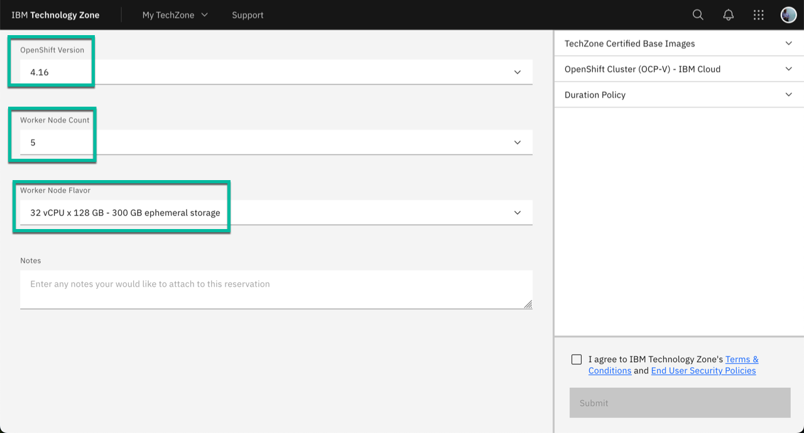

# Guide to provision an OCP Cluster in TechZone to be used with this repo

These assets were initially created to support the **OpenShift Cluster (VMware on IBM Cloud) - UPI - Public** template, however the TechZone Team has decided to transition to use OCP-V as the way to provision OCP clusters, and this repo has been updated accordingly, and now you have to use the **OpenShift Cluster (OCP-V) - IBM Cloud** template which is part of the *TechZone Certified Base Images* collection under *Base Openshift*. You can access the collection clicking [here](https://techzone.ibm.com/collection/tech-zone-certified-base-images/journey-base-open-shift). You can use the following image as a reference:

When making the reservation select **v4.16** for the OCP version and 5 nodes with 32 cores and 128 GB of memory to get the best results. Note you can use OCP v4.15 but I recommend you use the latest version if possible. Note that with the new OCP-V type of cluster in TechZone you do not need to select storage type because automatically provisions external ODF storage. The following image shows the recommended values:

Once your cluster is ready you can proceed with the rest of the instructions.

Go back to the main instructions clicking [here](README.md).